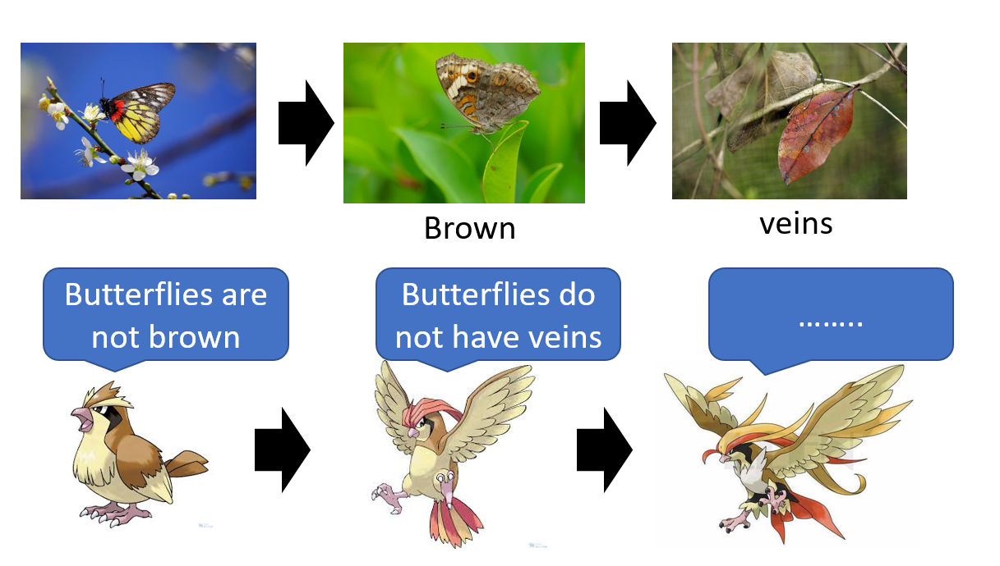
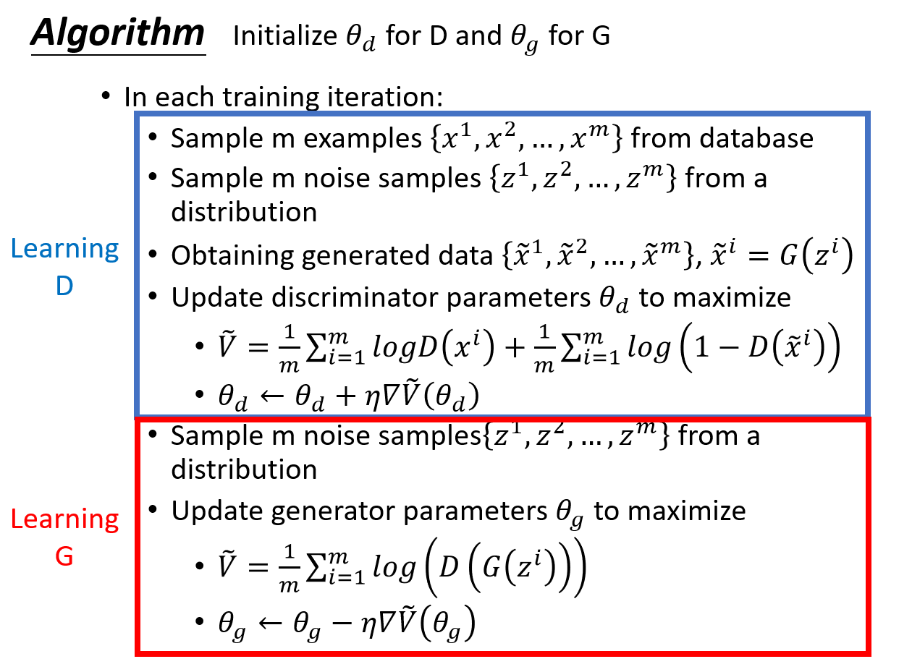
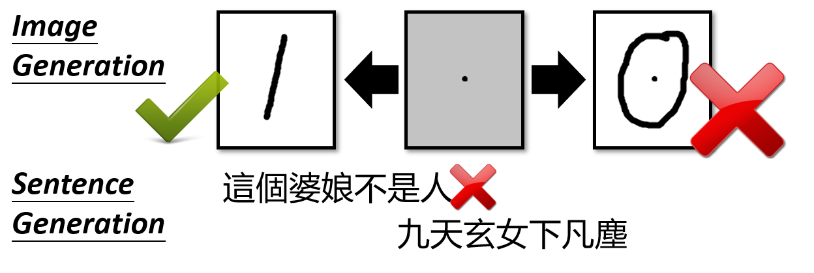
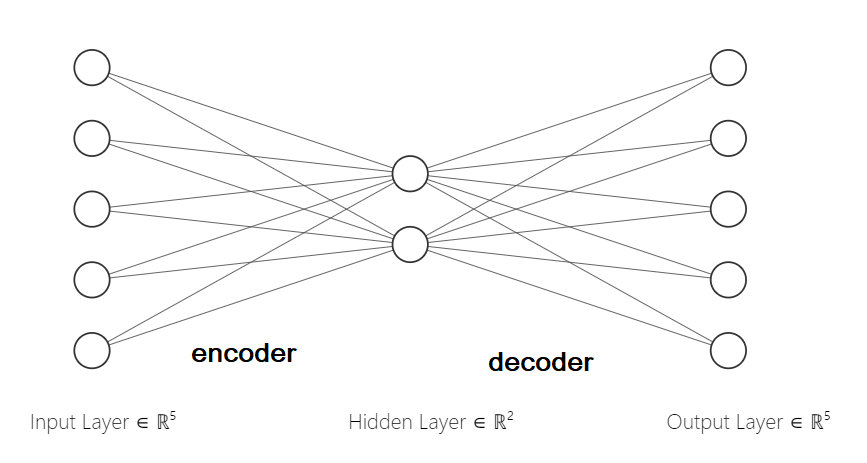
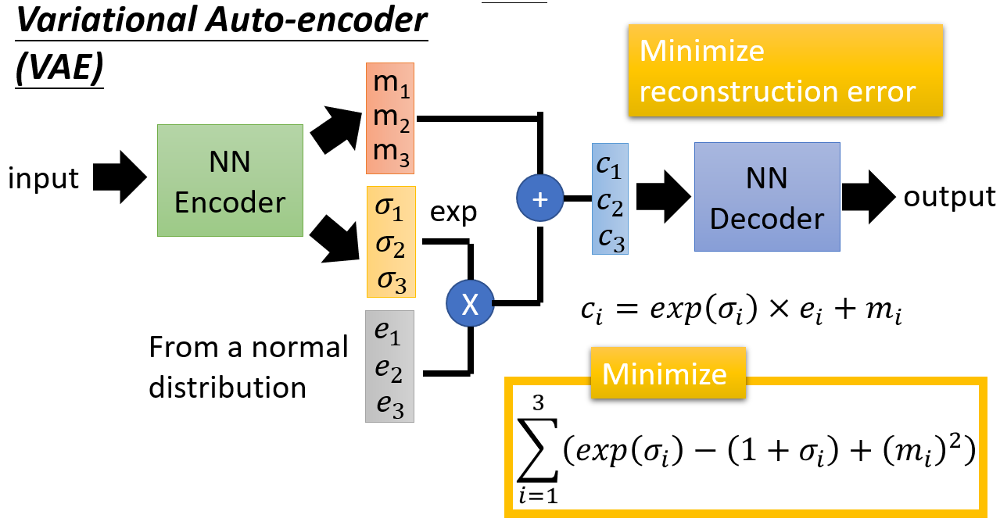
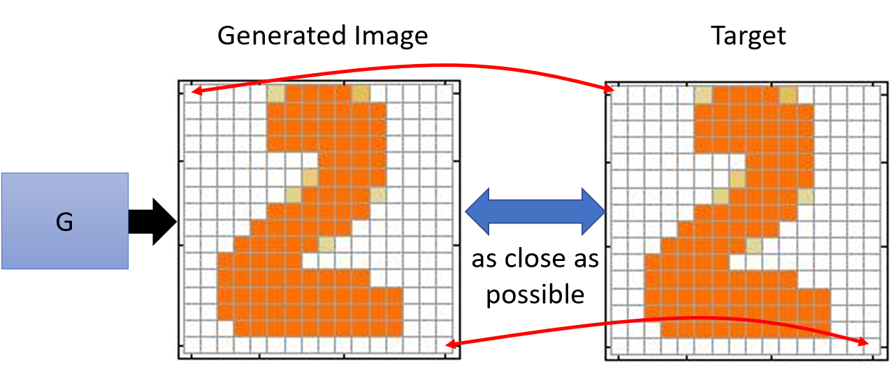
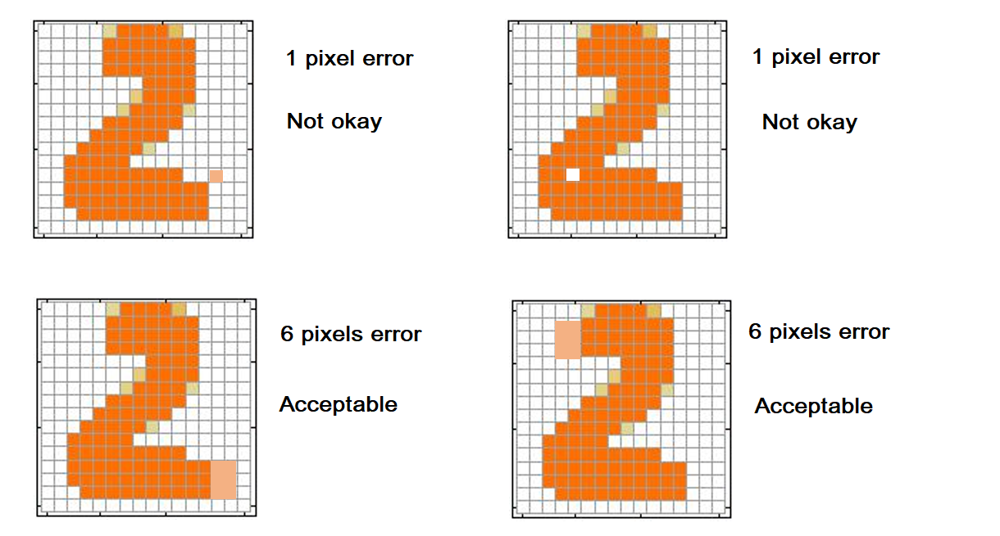
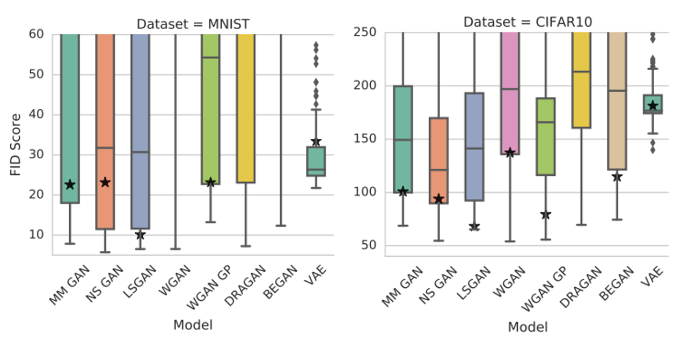

# Introduction to GAN
This is the notes for first lecture of a series of GAN lectures by Prof. Lee. It is heavily based on Prof. Lee's [video lecture](https://www.youtube.com/watch?v=DQNNMiAP5lw) and his [presentation slide](http://speech.ee.ntu.edu.tw/~tlkagk/courses/MLDS_2018/Lecture/GAN%20(v2).pdf).

## Table of Contents 

* [Importance of Generative Adversarial Networks](###importance-of-Generative-Adversarial-Networks)

* [Basic Idea of GAN](###basic-Idea-of-GAN)

* [GAN as Structured Learning](###GAN-as-Structured-Learning)
* [Can Generator Learn by Itself ?](###Can-Generator-Learn-by-Itself-?)
* [Can Discriminator Generate ?](###Can-Discriminator-Generate-?)
* [A Little Bit Theory](###A-Little-Bit-Theory)
## Importance of Generative Adversarial Networks

Generative Adversarial Network (GAN) is one of the most rapidly growing research field in AI. In fact, Yann LeCun, the director of Facebook AI Research stated on Quora twice, he thinks that **Adversarial Training** / **GAN** is the most interesting idea in ML in recent years. Yann LeCun is a legend in the field of ML, and his opinion is the testament to GAN's awesomeness 👍 

>[Adversarial training is the coolest thing since sliced bread.](https://www.quora.com/What-are-some-recent-and-potentially-upcoming-breakthroughs-in-unsupervised-learning)

>[The most important one, in my opinion, is adversarial training (also called GAN for Generative Adversarial Networks). This is an idea that was originally proposed by Ian Goodfellow when he was a student with Yoshua Bengio at the University of Montreal](https://www.quora.com/What-are-some-recent-and-potentially-upcoming-breakthroughs-in-deep-learning)

GAN was invented by Ian Goodfellow in 2014. Since then many variations of GAN were invented.There is a Github's page dedicated to listing variations of GAN, called the [GAN Zoo](https://github.com/hindupuravinash/the-gan-zoo). 

The naming convention of GAN is adding a alphabet before GAN. For example, **SGAN**. At the time of writing this note, there are **six** different GANs called SGAN as shown in following figure 👇 

* The following graph shows growth in number of GAN 

## Basic Idea of GAN

* GAN is a deep learning model which can be used to generate very realistic novel samples such as images, voices and sentences that is previously unseen to the model.
* It consists of two parts: **Generator** and **Discriminator**.
* Image Generation :
> [ 0.8, 0.4, ... , 0.2 ]  ⟶ Generator ⟶ 🤦‍

> [ 0.2, 0.1, ... , 0.7 ]  ⟶ Generator ⟶ 🤦
* Sentence Generation :
> [ 0.8, 0.4, ... , 0.2 ]  ⟶ Generator ⟶ "How are you ?"

> [ 0.2, 0.1, ... , 0.7 ]  ⟶ Generator ⟶ "Good evening "
* The generator is a neural network or a function.
* The generated image can be thought of as a high dimensional vector.
* Basic GAN basically has no practical usage because we have no control over the generations.
* Want each dimension of the input vector represents some characteristics at the output.
* For example, the last dimension corresponds to *emotion* 
* By changing the value of last dimension, can change the emotion.
> [ 0.8, 0.4, ... , **0.1** ]  ⟶ Generator ⟶ 😊

> [ 0.2, 0.1, ... , **0.9** ]  ⟶ Generator ⟶ 😂
* This is known as `Conditional Generation` and will be discussed in Chapter 2.
* Discriminator is a Neural Network which is give scores to the generated objects.
* Discriminator outputs a score, it is a scalar. 
* High score means the image is real.
* Low score means the image is fake.
>> Real ⟶ Discriminator ⟶ 1.0

>> Fake ⟶  Discriminator ⟶  0.1 

### Analogy of GAN:

A well-trained GAN can generate highly realistic image. The learning process of GAN can be described using an anology of evolution. 
1. In a forest, there are two type of animals: butterfly and bird.
2. Butterflies are food to the birds.
3. Initially, the butterflies wings are yellow and red, no camouflage at all.
4. The bird can easily spot the butterflies, by learning " butterflies are not brown"
5. This pressures the butterflies to evolve to have brown wings, which provide a camouflage because it has same colour as fallen leaves.
6. The birds cannot find these evolved butterflies.
7. Lack of food pushes the birds to learn to differentiate leaves and brown butterflies, learning "butterflies do not have veins".
8. To survive, the butterflies evolved to have veins patterns on wings.
9. This can go on and on.

In this anology, butterfly plays the role of <code>Generator</code>. Whereas, the bird plays the role of <code>Discriminator</code>.
* Generator is trying to fool Discriminator by generating realistic looking samples.
* Discriminator is trying to be better at discriminating fake samples.
* Both of them work together to become better iteratively, until the Generator can generate very realistic samples. 

### Algorithm

Both generator and discriminator are Neural Network (NN).
The algorithm for training GAN: 

**Explanation :**
* Initialize parameters (weights and biases) of generator G and discriminator D
* In each training iteration:
 > 1. Fix generator G, and update discriminator D.
 >* Database ⟶ Real samples , labeled 1
 >* Randomly sampled vectors from normal distribution ⟶ G ⟶ Generated samples, labeled 0
 >* Fix the parameters of generator
 >* Discriminator learns to give high scores to real samples by maximize <code>*log* *D*(*x_i*) </code>
 >* Gives low scores to generated samples by maximize <code>1 - *log* *D*(*x_tilde*) </code>
 >* Update discriminator parameters

 >2. Fix discriminator D, and update generator G
 >* Generator generates samples, labeled 1
 >* Generator learns to "*fool*" the discriminator
 >* Generate samples in such a way that discriminator gives high score to generated samples
 >* By maximizing <code>*log* *D*(*G*(*x_i*)) </code>
 >* Fix discriminator parameters
 >* Update generator parameters 

## GAN as Structured Learning

### What is Structured Learning ?

* Machine learning finds a function which maps input X to target Y
>>  *f* : X ⟶ Y
* Regression: output a scalar
* Classification: output a "class" in form of one-hot vector
>>* Class 1 = [ 1, 0, 0 ] 
>>* Class 2 = [ 0, 1, 0 ]
>>* Class 3 = [ 0, 0, 1 ]
* **Structured learning** outputs a sequence, a matrix, a graph, a tree ...
>>* Example, machine translation
>>>*  X: Fried rice is delicious (English)
>>>*  Y: Nasi goreng sedap (Malay)
>>* Speech recognition, X = speech signal and Y = Transcript
>>* Chatbot, X = "How are you ?" and Y = "I am fine"
>>* Image to image
>>* Text to image
* The components of the output have dependency / relationship with each other
* For example, output of Chatbot Y = "I am fine", the components are words "I", "am" and "fine". 
* Each of the word has dependency on other
* Structured learning is challenging because it is **one-shot / zero-shot learning**
    * One-shot learning, each class only has few training examples.
    * Zero-shot learning, no training examples.
    * For classification, each class has some examples.
    * For structured learning, each output is unique because there is no fixed class.
    * For example, machine translation, the target for each input is different.
    * If you consider each possible output as a *class* , the output space is very large.
    * Plus, most "classes" do not have any training examples.
    * During testing, machine has to create something new, unseen in training set.
    * This requires more intelligence compared to normal classification.
* Machine has to **plan**.
    * Generates objects component-by-component.
    * Must have a *big picture* in its mind.
    * There is relationship between components of output.
    * For example, generating response for Chatbot word-by-word.
    * Words in a sentence have dependency with each other.
    * Cannot treat each of the word independently / separately.
    * Should treat them as a whole / considered globally.

Structure Learning Approach:
1. Bottom Up: Learn to generate the object component-by-component.
> Example: Generator
2. Top Down: Evaluate the object as a whole, and find the best one.
> Example: Discriminator

## Can Generator Learn by Itself ?

* **Auto-encoder** can be used for generation of objects such as image.
* Consists of 2 parts: Encoder and Decoder.
* Encoder's number of units is smaller at the output
* Encoder encodes input image into a lower dimension vector called code.
* Decoder's output layer has the same number of units as encoder's input layer.
* Decoder receives the code from decoder.
* Decoder tries to reconstruct the input image from the code.
* Training objective: Want input and output as close as possible.
> Image ⟶ Neural Network Encoder ⟶ code ⟶ NN Decoder ⟶ Reconstructed Image
* The encoder's output must have less number of units.
* Or else, the auto-encoder only learns to be a identity matrix, copy from input to output.
* Decoder does the job of generator.
* However, autoencoder's decoder not necessarily generate realistic / meaningful output when given a code
* For example, two codes *a* and *b* when input to generator, generates meaningful output.
* Linear combination of these codes when input to generator, may not generate meaningful output.
> *a* ⟶ Generator ⟶ Image , *b* ⟶ Generator ⟶ Image
> * 0.5 *a* + 0.5 *b* ⟶ Generator ⟶ Noise

* Variational auto-encoder is more stable

* The training objective is to have generated image as close as possible to the target.
* The loss function used may be L1 or L2 norm of the difference of two image (generated and target).
* That means it compares them pixel-by-pixel

* If the generator can reproduce (copy) the target image, it is fine.
* But if it make mistakes 
    * Some mistakes are okay, while some are not
    * Small difference in pixels doesn't mean that the generated image is acceptable.
* For example:

* On the top, two 1-pixel error generated images.
* On the bottom, two 6-pixels error generated images.
* To the machine, the images on the top are better 
* To human, the top images are not okay. The images on the bottom despite more pixel differences from the target, are acceptable.
* Auto-encoder generate the image pixel-by-pixel.
* Each pixel may be dependent on other pixels.
* The relation between them are critical.
* Each output unit of the auto-encoder correspond to a pixel.
* The pixels are highly correlated.
* However, they cannot influence each other because the decoder can't capture the relationship between each pixel
* If the decoder has more layers, it might be able to capture the relationship between the pixels.

## Can Discriminator Generate ?
* Discriminator is a function (NN) which outputs a scalar
* Given an input *x* (eg. image), output D(*x*) which is a score of how "good" *x* is.
* Discriminator can easily capture the relationship between components by top-down evaluation.
* To capture relationship between pixels of image, CNN filter is good enough.
* Discriminator can generate objects by solving the following optimization problem:
> * Generate object *x_tilde* such that:
>   * <code>*x_tilde* =  argmax D(*x*) for all *x*</code>
* It is not feasible because need to enumerate all possible *x*.
* Even if there is a way
* Like critics, discriminator is only good at criticizing other people's works.
* Discriminator is bad at coming out with something constructive.
* For training, discriminator need negative training examples.
* Negative examples are critical.
* Must have a method of producing good negative examples (realistic enough) so that discriminator can learn to discriminate good and fake.
* Which in turn can use this knowledge to generate better examples.
* A possible algorithm to train discriminator to generate objects:
> * Assuming <code>argmax</code> optimization problem can be solved.
> 1. Given a set of positive (real) examples, randomly generate a set of negative examples.
> 2. In each iteration:
>   * Learn a discriminator D that can discriminate positve and negative examples.
>   * Generate negatve examples by discriminanator D by solving <code>argmax</code> problem
>
* Note: Next iteration, use improved discriminator to generate better negative examples.
* Repeat iteratively, discriminator will learn to generate good objects.

* Real examples in green, negative examples in blue.
* Red line is the decision boundary of D denoted D(x).
* During training, D to give lower score to negative examples and high score to real examples
* D(x) increases for real examples, increase for negative examples.
* However, practically cannot decrease D(x) for every negative examples because only have finite number of negative examples
* In 3, negative examples are generated at area with high D(x) from previosly.
* In the end, the distribution of real and negative examples are the same
* Can generate very realistic negative examples that D(x) is unable to tell apart.

## Generator vs. Discriminator
**Generator:**
>Pros :
> * Easy to generate even with a deep model.

>Cons :
> * Imitate appearance of target image.
> * Hard to learn correlation between components. 
> * Compared to GAN, need a deeper Auto-encoder to learn the correlation at similar level.
> * Touch on surface, didn't get the big picture / core idea

**Discriminator:**

> * Consider the *big picture*, ie. capture relation between components 

>Cons :
> * Generation is feasible
> * NN is non-linear
> * Can be solved with a linear assumption
> * But this in turns limit the generation capability
> * Problem with negative sampling

**Generator + Discriminator**
* Generator does negative sampling
* Replace the need of solving <code>argmax</code> problem
* Disciminator gives high score to real examples, low score to negative examples.
* Generator used this feedback to learn to generate objects that discriminator will give high score. 
* In other words, use NN to learn to solve <code>argmax</code> problem of D.

From discrminator's point of view:
* Use generator to generate negative examples is more efficient
* Rather than have to solve the complicated *argmax* problem

From generator's point of view:
* Still generate the object component-by-component.
* But it is learned from the discriminator which has a big picture of whether generated object is "good" or not.

**Result :**

A experiment to evaluate different version of GAN.
* FID score: smaller is better.
* Each colour represents FID score for one type of GAN.
* Vertically: different set of parameters.
* Similar results for different version of GAN.
* For VAE, the vertical bar is much shorter.
* This means that VAE is more "stable", has similar results despite different parameters.
* GAN is less stable.
* Low FID score for lots of parameters settings.
* For GAN, works well only with specific set of parameters.
* However, GAN with best parameters outperforms VAE.

References: 
1. [Are GANs Created Equal? A Large-Scale Study](https://arxiv.org/pdf/1711.10337.pdf)
