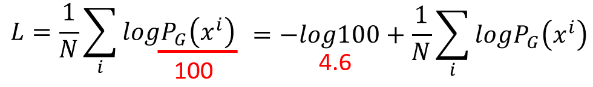
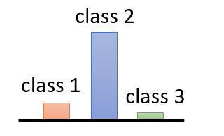
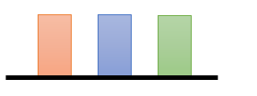
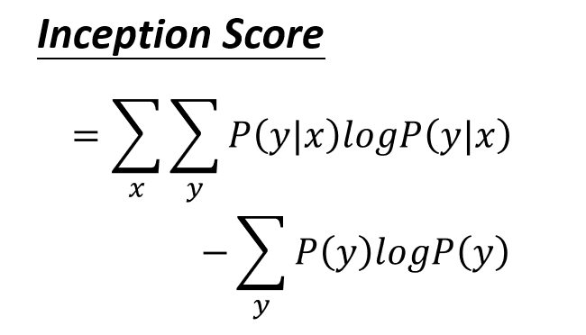
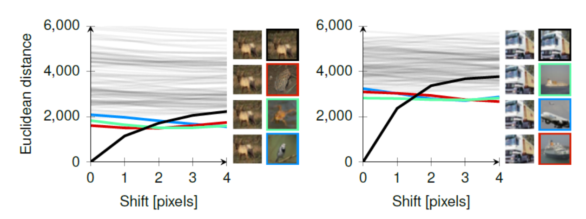
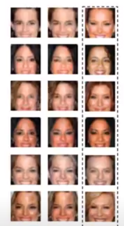

## Evaluation 

* Evaluation of the quality of objects generated by GAN
* The easiest method is to have humans take a look at these objects 

### Likelihood

* Take some real images
* Calculate log-likelihood for these images 
* However, we cannot compute <code>P_G(x_i)</code>
* We can only sample from <code>P_G</code>

### Kernel Density Estimation

* Sample from <code>P_G</code>
* Approximate the generated samples with Gaussian Mixture Model (GMM)
* We can calculate the likelihood for this estimation
* However, there are problems
    * How many samples are needed  ?
    * How many Gaussians ?
* There is some weird issues:
    * Likelihood calculated for generated images > likelihood calculated for real images
* Besides that, high likelihood does not mean that generated samples have high quality

#### Likelihood vs. quality

1. Low likelihood vs. high quality ?
    * GAN may face mode collapse
    * Repeated generation of same type of images with slight differences
    * High likelihood for these images
    * But low likelihood for other type of real images

2. High likelihood vs. low quality ?
    * Let say we have two Generators denoted by **G1** and **G2**
    * G1 is a good generator which generates high quality images
    * G2 has 99% probability of generating noise and 1% probability of generating high quality images
    * The probability of generating a valid image for G1 is 100 times compared to G2
    
    * The calculated log-likelihood for G1 and G2 differs only by 4.6
    * Therefore, likelihood is not a good measure of the quality of generated samples

### Objective Evaluation

* Evaluate the generated samples using an off-the-shelf image classifier such as Inception Net or VGG

* Look at the output of the classifier, if the probability distribution is concentrated on a class, this means **higher quality generation**
* GAN may suffer from mode collapse
* To evaluate whether GAN is **diverse** 
* Sample from P_G 
* Each sample generate a distribution
* Calculate the average for the distributions

* If the average distribution is uniform, this means higher diversity or more variety in the generated samples
* Different class of images are also generated
* The overall score is called Inception score 

* The first term is negative entropy, measures the distribution for each generated samples is sharp or not
* The second term is entropy of P(y), measures diversity in generation

### Memory GAN

* We do not want GAN to memorize the images 
* Generating images very similar to real images 

* Using L1 or L2 to measure similarity between generated images and images in database pixel by pixel is a bad idea
* Each line represents one of the 8 images 
* The top left image is the original image
* x-axis represents shift of original images by pixels
* y-axis represents difference with original image
* It shows that with minimal shift in pixels, the Euclidean distance becomes large

Another method :
* Paper: Do GANs learn from the distribution? Some theory and empirics , 2018
* Sample from GAN
* Use neural network to evaluate images are similar or not
* Then pass to human to evaluate

* The rightmost are similar images from the database of real images
* Can estimate the number of different faces
* DCGAN can generate 0.1 mil faces
* ALI can generate 1 mil faces
* Still smaller than number of faces in database of real images

### Minibatch Discriminator

* Modify the discriminator to take in minibatch of images
* Minibatch of real images are diverse
* If minibatch of generated images are similar, the discriminator can find out
