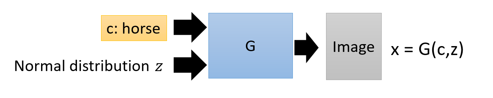
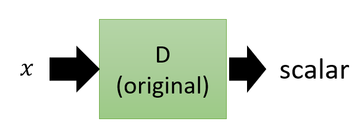
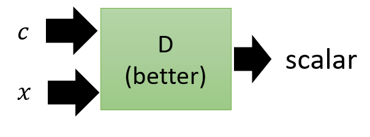
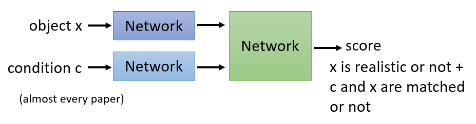
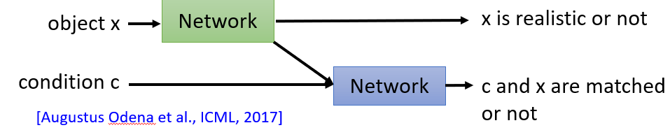
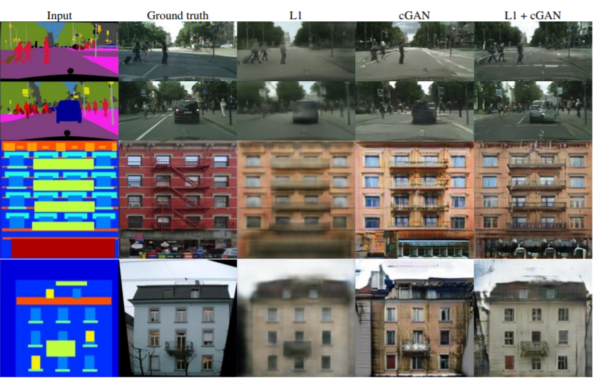
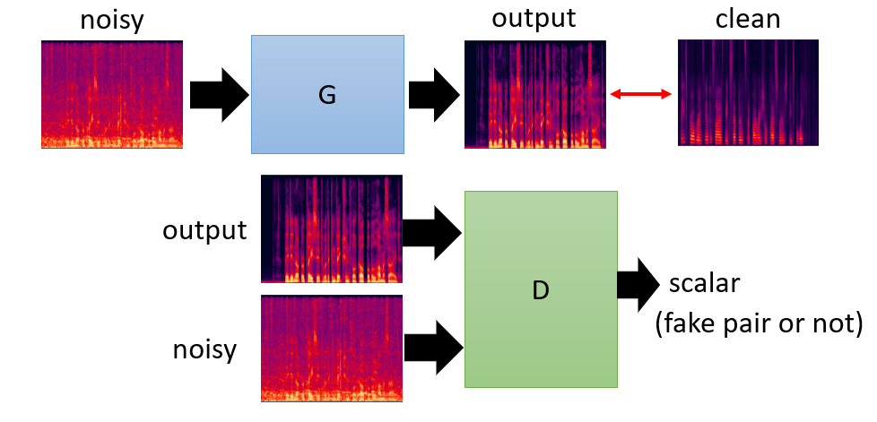
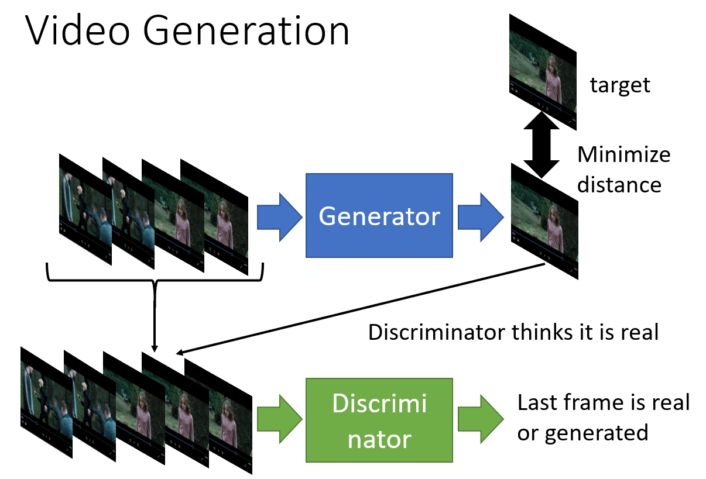

## Conditional Generation

## Traditional Supervised Approach

* Given a dataset of pairs of text and image
* Text describes the image
* Pass them to a Neural Network where input <code>X</code>: text and output <code>Y</code>: Image
* Have one problem: Generated image is blurry
* Why is it blurry ?
* Because Neural Network learns to generate something that is an average of all the training samples
* For example, let say we have *horse* in our dataset
* In some of the samples, *horse* is facing left. Some samples, *horse* is facing right
* Loss function used is L1 or L2 norm or mean squared error
* NN learns to generate something that is as close as possible to all the training samples of "horse" facing left, front and right etc
* Averaging them, resulting in generating a blurry image of *horse*

## Conditional GAN
**Generator**

* Generator takes in 2 vectors as input
* Code denoted by <code>c</code> specify the thing we want to generate
* <code>z</code> is a vector randomly sampled from Normal distribution
* Generator is a function of <code>c</code> and <code>z</code>

**Discriminator**

* Discriminator outputs a scalar which determines whether input is realistic or not
* Original D design won't work
* G only learns to generate realistic images 
* Meanwhile, it'll ignore the input condition <code>c</code>
* Discriminator needs to consume **G's input and output** as following:

* Scalar = <code>x</code> realistc or not + <code>x</code> and <code>c</code> are matched or not

| Type      | Label         | 
| ------------- |:-------------:| 
| Text + matched realistic image     | 1 | 
| Text + matched unrealistic image     | 0  |   
| Text + not matched image | 0     | 

**Two Implementation of CGAN**

Implementation 1:

* Most paper implement this architecture
* Scalar combines two evaluation
   * x is realistic or not
   * c and x are matched or not
* Generator won't know which area it is not good at

Implementation 2:

* Make more sense
* Two Discriminator network
* First Discriminator takes as input *x* and output a scalar: *x* is realistic or not
* Another Discriminator takes code *c* and output of first Discriminator as input, outputs a scalar: *c* and *x* are matched or not.
* In this implementation, G can know which is the source of mistake

**Stack GAN**
* Paper: [StackGAN: Text to Photo-realistic Image Synthesis with Stacked Generative Adversarial Networks](https://arxiv.org/abs/1612.03242)

* Two GANs
* First GAN is a CGAN generates 64 x 64 image from text description
* Second GAN enlarge to 64 x 64 image to 256 x 256 image
* 2 stage generation ensures generation of realistic images

**Comparison**

Paper: [Image-to-Image Translation with Conditional Adversarial Networks](https://arxiv.org/pdf/1611.07004.pdf)

*Traditional supervised approach* vs. *CGAN*

* Task: Image-to-image transformation

Example:

* Traditional supervised approach
> image → Neural Network → image 
> * Generated image as close as possible to target
> * Result is blurry because it's average of several images
> * Look at L1 column

* On other hand, GAN's generated image is clear, but got some "unintended" stuff

* For example:

* Red circle: Got something like a window
* Not intended in the input

**Patch GAN**

* Generated image is very large
* Discriminator only looks at a small part of the generated image
* If Discriminator only looks at one single pixel, it's called Pixel GAN, basically useless.

**Speech Enhancement**

* Remove noise from speech signal
* Typical deep learning approach:
> * Given pair of noisy and clean speech
> * noisy speech → Generator (CNN) → Output
> * Want output as close as possible to target (clean speech)

* Conditional GAN:

**Video Generation**

* Generator generates the next frame
* Want the generated frame to be as close as possible with the target
* Discriminator determines the last frame is real or generated
* Discriminator takes in input frames and generated frame as input

Example:
Link: https://github.com/dyelax/Adversarial_Video_Generation

* For non-adversarial method, the monster sometimes will split to two
* One go to left, one go to right
* Because the NN learns to generate average of training samples
* Training samples which include going to left and right

* For adversarial method, the monster won't split into two
* But it's not perfect
* Sometimes, the monster will disappear