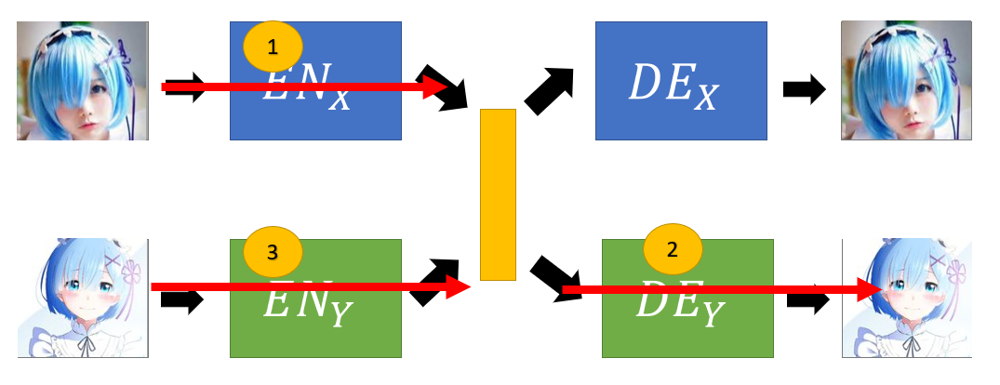

## Unsupervised Conditional Generation

* Transform an object from one domain to another **without paired data**.
* For examples:

**Image Style Transfer**

**Voice Transfer**

Two Approaches:

1. Direct Transformation
2. Projection to Common Space

**Direct Transformation :**
* Cannot change or transform the image too much
* For texture and colour change
* Use GAN for image style transfer
Implementation 1:

* Domain X : Source style
* Domain Y : Target style
* Collect images for domain X and domain Y
* Generator : Transform the image from domain X to Y
* Discriminator : Input image belongs to domain Y or not
* We do not want the output to be very different from original image
* **Problem** : 
    * Generator may learn to generate images similar to training examples of domain Y but different from input image
    * While ignoring the input
* Ignore this problem and train it, it works also
    * The generator is not given any constraint, won't generate image that is very different from the original image
* **Solution 1**
    * Change Generator network design
    * Make the Generator simple
    * So input and output of Generator won't be very different
* **Solution 2**
    * Use a pre-trained encoder network
    * Encode the input and output of the Generator
    * Results in 2 vectors
    * Generator has to fool the discriminator
    * At the same time, wnat these two embedding vectors to be as close as possible to each other

**Solution 3: Cycle GAN**

* X to Y domain generator <code>G_X⟶Y</code> : Transform image from domain X to domain Y
* Y domain discriminator <code>D_Y</code> : The generated image belongs to domain Y or not
* Y to X domain generator <code>G_Y⟶X</code> : Transform the generated image in domain Y back to domain X
* In addition to fooling discriminator
* Wants the input and generated image to not differs too much
* By transform the image generated by <code>G_X⟶Y</code> back to domain X using <code>G_X⟶Y</code> hope the transformed image is similar to the input image
* This is achieved using cycle consistency
* Cycle consistency: Minimize differences between input image in domain X and the reconstructed image
* Generator learns to retain information about the input image when generating
* In this way, the Generator <code>G_X⟶Y</code> doesn't have enough information to generate images similar to training examples of domain Y which is dissimilar from the input image

**Complete Cycle GAN**

* Transform images of domain Y to domain X as well
* Learn side by side
* Note : Can actually train a successful Cycle GAN without using cycle consistency.

**Issue of Cycle Consistency**

* Cycle GAN is a master of Steganography: hiding information 
* For example, red rectangle in input and reconstructed images have black dots
* Whereas, the generated image in domain Y does not have any dots
* It has ability to hide information necessary for reconstruction
* May be the black dots are hidden using small pixel values ( in the middle image ) that human cannot differentiate from surrounding pixels
* Network learn to bypass the constraint set by cycle consistency
* Make CycleGAN lose its usefulness to transform image without changing too many things
* This is still under research

### Additional :

1. Disco GAN and Dual GAN
* Same as CycleGAN
* Different research groups come out with similar stuffs at almost the same time
2. Dual GAN
* Transform to more than one domains

**Projection to Common Space**

* Larger change in output image, only keep the semantics
* For example, domain X is real person's face
* Domain Y is anime character's face
* Collect face images of real person and anime character
* Note that the images in domain X and domain Y are not paired 
* The difference between both domain is more than just the difference in style 
* Consists of 2 autoencoders
* Encoders transform both images of domain X and Y to a common space
* Transform to common space means encode using both encoders into a vector (Yellow in diagram) 
* Encoder X extract features of real face images
* Encoder Y extract features of anime face images
* We hope each dimension of the vector represents a type of face attributes as a result of training
* Decoder X <code>DE_X</code> transforms the vector to real face image
* Decoder Y <code>DE_Y</code> transforms the vector to anime face image
* Red arrow: Minimize reconstruction error
* <code>D_x</code> Discriminator of domain X
* <code>D_y</code> Discriminator of domain Y
* Discriminator forces the generated image to be of higher quality
* Looks like 2 VAE-GAN
* Adding discriminator can be thought of as using GAN to improve auto-encoder performance
* Or using auto-encoder to improve the performance of GAN
* Possible training strategy:
    * Train both VAE-GAN separately
    * VAE : Minimize reconstruction error
    * Discriminator: Similar to GAN training
* Problem: 
    * If both of the autoencoders are trained separately
    * For images of domain X and domain Y, the same attribute such as eye colour may not project to the same position in the latent space
    * In other words, each dimension of the encoding vector does not represent the same type of face attribute for images from domain X and domain Y because they are trained independently

## How to solve this mismatch due to independent training ?
**Solution 1: Sharing parameters**

* Share the paremeters or weights among the encoders and the decoders
* We hope that this may be will result in same attributes of images of different domain lands at the same position in latent space

References:
1. Couple GAN [Ming-Yu Liu, et al., NIPS, 2016]
2. UNIT [Ming-Yu Liu, et al., NIPS, 2017]

**Solution 2: Domain Discriminator**

* Same spirit as the Domain Adversarial Training
* Domain discriminator determines whether the input image is from Encoder X or Encoder Y
* Encoder X and Y have to learn to fool the domain discriminator
* If the domain discriminator becomes incapable of determining whether the vector comes from domain X or Y
* This means that the domain discriminator forces the output of Encoder X and Encoder Y to have the same distribution
* Because they have same distribution, possible to expect the same dimension stores the same feature for both anime face image and real face image
Reference:
1. [Guillaume Lample, et al., NIPS, 2017]

Solution 3: Cycle Consistency

* Used in ComboGAN
* Encoder X encodes input image from domain X to a vector
* Decoder Y tries to decode the vector into a image from domain Y
* Discriminatior Y decides whether it looks like image from domain Y
* The decoded image is then taken as input by the Encoder Y
* This encodes the decoded image to a vector
* Then, this vector is decoded by Decoder X into an image from domain X
* Minimize the error between the input image and Decoder X's decoded image

Reference:
1. ComboGAN [Asha Anoosheh, et al., arXiv, 2017]

Solution 4: Semantic Consistency

1. Encoder X encodes the input into a vector
2. This vector is decoded into domain Y using Decoder Y
3. Then, decoded image is encoded into a vector
    * Minimize difference between these two vectors

* This technique is used in XGAN

References:
1. DTN [Yaniv Taigman, et al., ICLR, 2017]  
2. XGAN [Amélie Royer, et al., arXiv, 2017]

**Voice Conversion**

* In the past, need speakers X and Y speak the same thing
* Now, speakers X and Y can talk about different things
