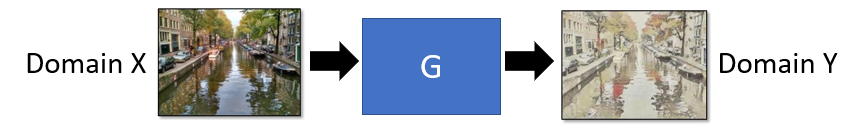
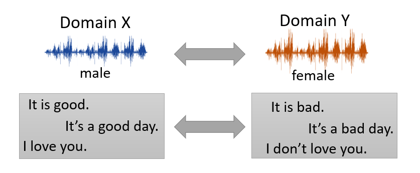
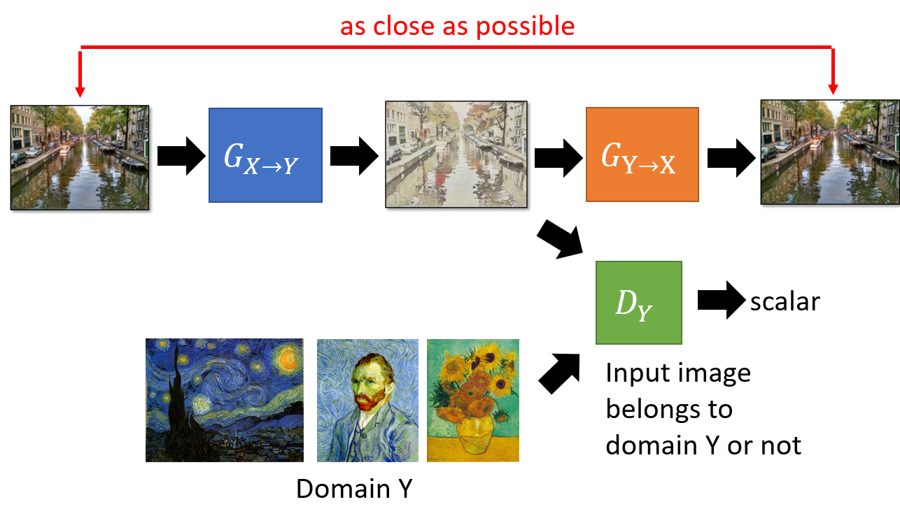
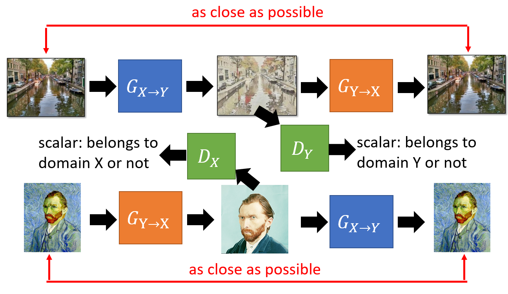
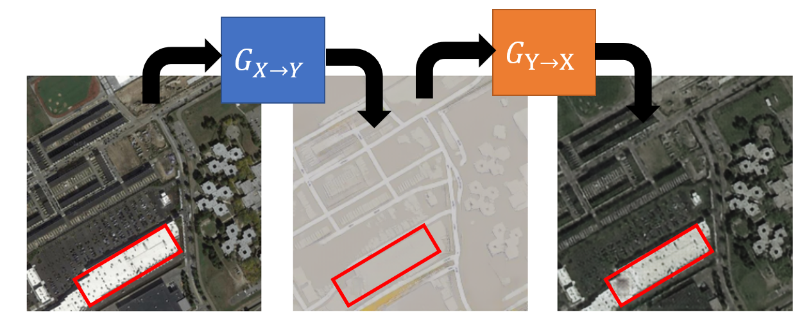
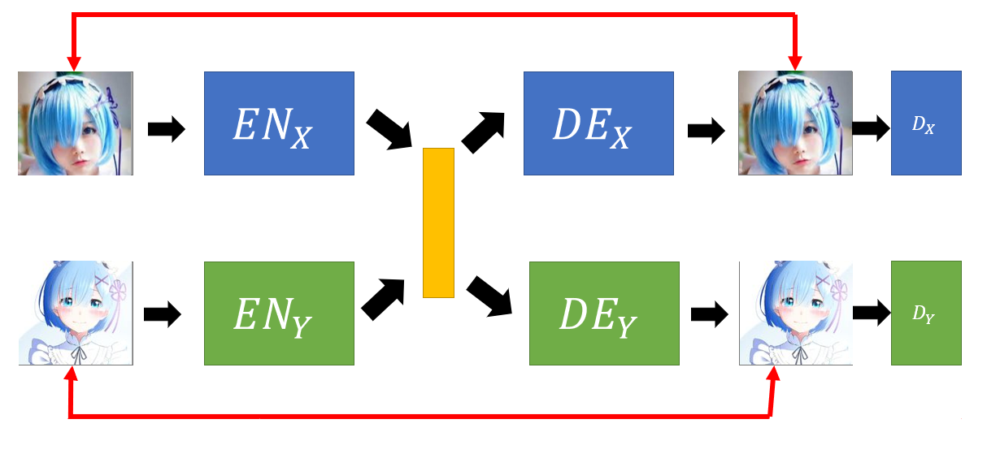
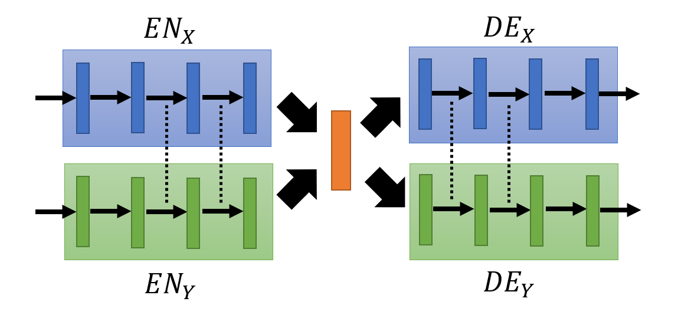
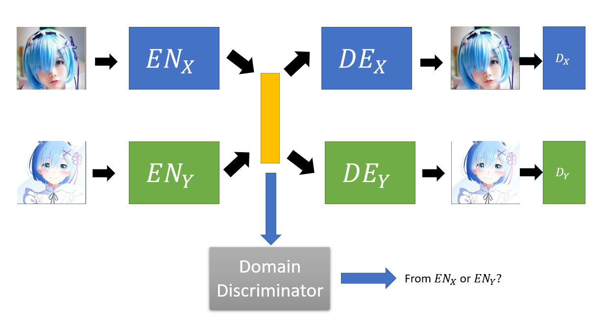
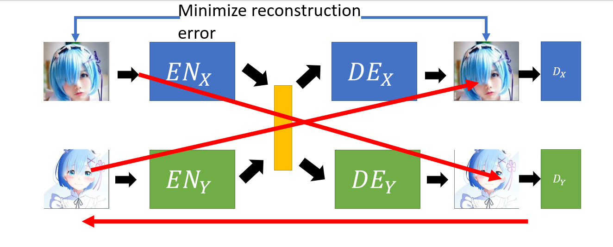

## Unsupervised Conditional Generation

* Transform an object from one domain to another **without paired data**.
* For examples:

**Image Style Transfer**

**Voice Transfer**

Two Approaches:

1. Direct Transformation
2. Projection to Common Space

**Direct Transformation :**

* Use GAN for image style transfer
Implementation 1:

* Domain X : Source 
* Domain Y : Target style
* Collect images for domain X and domain Y
* Generator : Transform the image from domain X to Y
* Discriminator : Input image belongs to domain Y or not
* **Problem** : 
    * Generator may learns to generate images similar to training examples of domain Y
    * While ignoring the input

* **Solution 1**
    * Change Generator network design
    * Make the Generator simple
    * So input and output of Generator won't be very different

* **Solution 2**
    * Use a pre-trained encoder network
    * Encode the input and output of the Generator
    * Results in 2 vectors
    * Want these 2 vectors to be as close as possible to each other

**Solution 3: Cycle GAN**

* <code>G_X⟶Y</code> : Transform image from domain X to domain Y
* <code>D_Y</code> : The generated image belongs to domain Y or not
* <code>G_Y⟶X</code> : Transform the generated image in domain Y back to domain X
* Cycle consistency: Minimize differences between input image in domain X and the reconstructed image
* Generator learns to retain information about the input image when generating
* In this way, the Generator <code>G_X⟶Y</code> doesn't have enough information to generate images similar to training examples of domain Y which is dissimilar from the input image

**Complete Cycle GAN**

* Transform images of domain Y to domain X as well
* Learn side by side
* Note : Can actually train a successful Cycle GAN without using cycle consistency.

**Issue of Cycle Consistency**

* Cycle GAN is a master of Steganography
* Hiding information 
* For example, red rectangle in input and reconstructed images have black dots
* Whereas, the generated image in domain Y does not have any dots
* It has ability to hide information necessary for reconstruction

**Projection to Common Space**

* Consists of 2 autoencoders
* Transform both images of domain X and Y to a common space
* Common space is a vector (Yellow in diagram) 
* Each dimension of the vector represents a type of face attributes
* Or we hope so
* Red arrow: Minimize reconstruction error
* <code>D_x</code> Discriminator of domain X
* <code>D_y</code> Discriminator of domain Y
* Looks like VAE-GAN

 Problem: 
* Because both of the autoencoders are trained separately
* For images of domain X and domain Y, the same attribute such as eye colour may not project to the same position in the latent space
* In other words, each dimension of the encoding vector does not represent the same type of face attribute for images from domain X and domain Y

Solution 1: Sharing parameters

* Share the paremeters or weights among the encoders and the decoders
* In the hope that this will result in same attributes of images of different domain lands at the same position in latent space

References:
1. Couple GAN [Ming-Yu Liu, et al., NIPS, 2016]
2. UNIT [Ming-Yu Liu, et al., NIPS, 2017]

Solution 2: Domain Discriminator

* Domain discriminator determines whether the input image is from Encoder X or Encoder Y
* Encoder X and Y have to learn to fool the domain discriminator
* The domain discriminator forces the output of Encoder X and Encoder Y to have the same distribution

Reference:
1. [Guillaume Lample, et al., NIPS, 2017]

Solution 3: Cycle Consistency

* Used in ComboGAN
* Encoder X encodes input image from domain X to a vector
* Decoder Y tries to decode the vector into a image from domain Y
* The decoded image is then taken as input by the Encoder Y
* This encodes the decoded image to a vector
* Then, this vector is decoded by Decoder X into an image from domain X
* Minimize the error between the input image and decoded image

Reference:
1. ComboGAN [Asha Anoosheh, et al., arXiv, 017]

