## Theory Behind GAN

* Image can be viewed as a high dimension vector.
> For example, a 28 x 28 image can be unrolled into a vector with 784 dimension,
* An image is a point in a high dimensional space. In this case, it is <code>R^784</code>
* Out of all possible vectors in <code>R^784</code>, a lot of them are not valid images
* Valid images are distributed at some region of this space.

    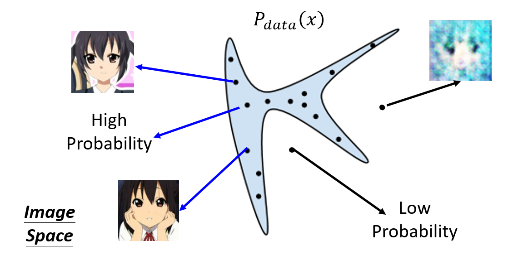
* We want to find a  data distribution <code>Pdata(x)</code> such that:
    * Valid images have high probability
    * Invalid images have low probabilty

* How to find the distribution <code>Pdata(x)</code> ?
> Use Maximum Likelihood Estimation

**Maximum Likelihood Estimation**

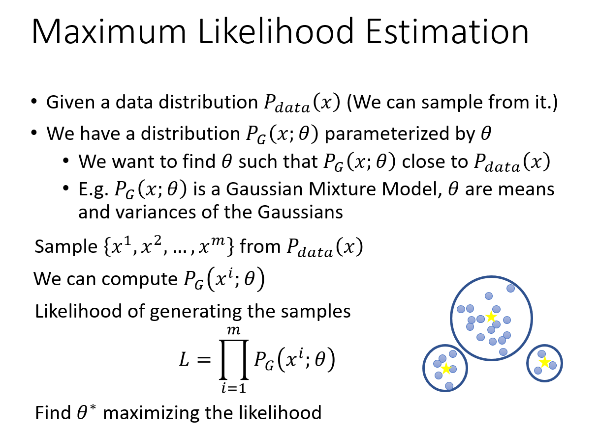

Explanation:

* We do not know the distribution <code>Pdata(x)</code>
* But we can sample from <code>Pdata(x)</code>
* Sample from Pdata(x) means that we have a database of valid images and can sample from it
* We aim to find a distribution <code>P_G(x; theta)</code> where theta is the parameters
* Let's assume the distribution <code>P_G</code> is a Gaussian Mixture Model (GMM)
* In this case, the parameters would be the means and variances
1. Sample from <code>Pdata(x)</code>
2. Calculate likelihood of <code>P_G</code> generating the samples 
3. Find a set of parameters which maximizes the likelihood

**Maximum Likelihood Estimation = Minimize KL Divergence**

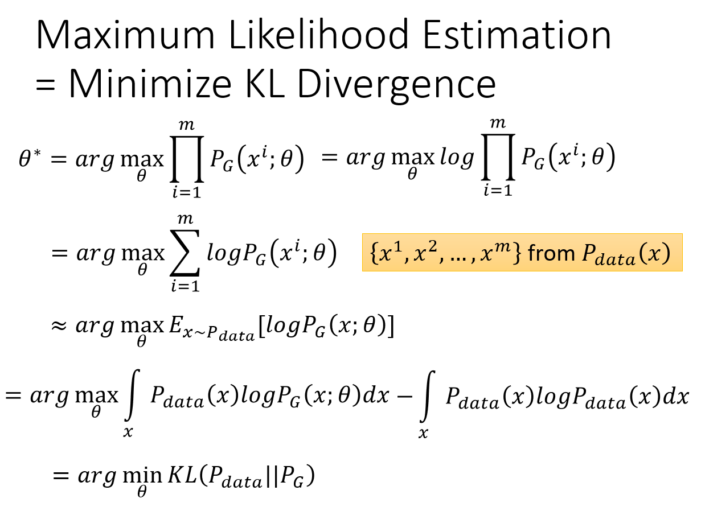

* Maximizing likelihood is equivalent to minimizing KL divergence
* What is divergence ?
* Divergence measures how "close" are two different distribution
    * If two distribution is far apart, divergence should be large
    * If two distribution is close, divergence should be small
* Maximum likelihood estimation can be expressed in terms of KL divergence between <code>Pdata</code> and <code>P_G</code>
* Gaussian Mixture Model is used in 1980s  to generate images
* However, the generated images are blurry
* Images are high dimensional data which resides on a low-dimensional manifold
* As such, no matter how we tweak the parameters, <code>P_G</code> cannot approximate <code>Pdata</code>
* Because regardless of the parameters, cannot result in low dimension distribution
* How to define <code>P_G</code> if a neural network is used to generate images ?

**Generator**

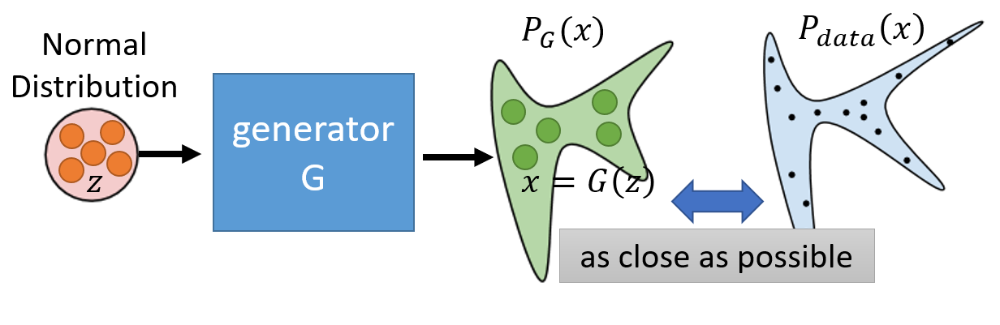

* Generator is a neural network which can be used for generation
* We sample fixed dimension vectors, *z* from normal distribution
* These vectors are fed to the generator *G*
* Let's assume this generator *G* is used for image generation
* These generated images form a distribution <code>P_G</code> 
* In other words, Generator G defines a probability distribution <code>P_G</code>
* We want <code>P_G</code> as possible to <code>Pdata</code>
* We want to find a Generator, G* which minimizes the divergence between <code>P_G</code> and <code>Pdata</code>
    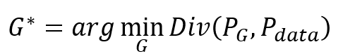
* We know how to calculate KL divergence if GMM is used

Two Problems of Using neural network as Generator :
1.  We do not how to measure divergence between <code>P_G</code> and <code>Pdata</code>
2.  We also do not know how to obtain <code>P_G</code> and <code>Pdata</code>

* However, we can sample from <code>P_G</code> and <code>Pdata</code>
1.  Sample images from <code>P_G</code> : 
    * Sample some vectors from normal distribution
    * Pass these vectors to Generator
    * Generator generates images
2. Sample images from <code>Pdata</code> :
    * Select from database of real images

**Discriminator**
* We can use discriminator, **D** to measure divergence between <code>P_G</code> and <code>Pdata</code>
* Train a discriminator is exactly the same as training a binary classifier
* We have two classes: Real images (labeled 1) and generated images (labeled 0)

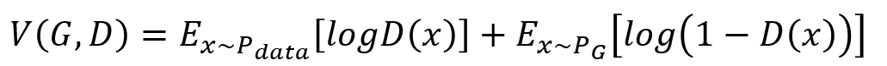

* Note that Generator's parameters are not updated when training Discriminator
* The training objective is to find a D* which maximizes <code>V(G,D)</code>

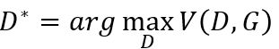

* The maximum value, <code>max[V(G,D)]</code> is related to JS divergence

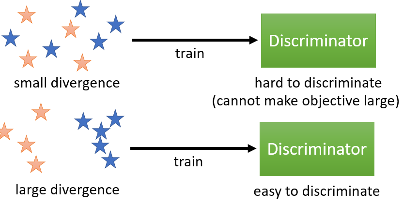

* Blue = Data sampled from <code>Pdata</code>
* Orange = Data sampled from <code>P_G</code>
* If both distributions are close, it is hard to discriminate
* Training is going to stuck, cannot make objective value larger
* If both distributions are far apart, it is easy to discriminate
* Training can make objective value larger

**Maximum objective value can be expressed in terms of JS divergence mathematically**

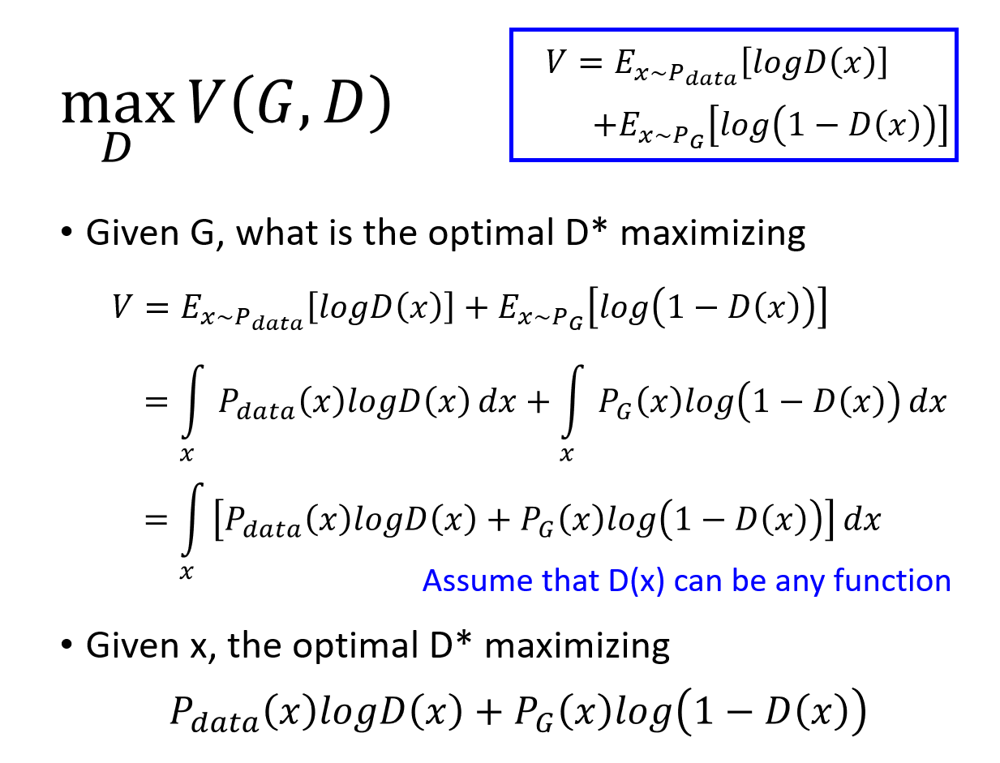

* Training discriminator to evaluate or measure JS divergence between <code>P_G</code> and <code>Pdata</code>

* The loss function of generator can be rewrite as :
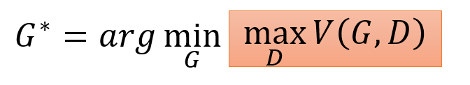

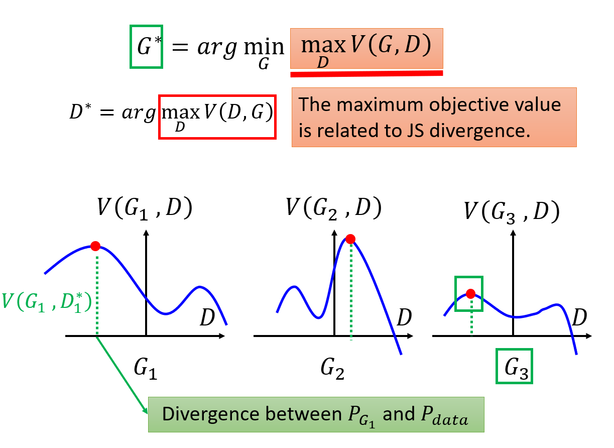

* Let say there are three Generators G1, G2 and G3
* Red dot indicates the maximum objective value
* We want a generator which minimizes the maximum objective value
* Which generator should we select ?
* Pick generator G3 because it has the smallest maximum objective value 

**Training GAN**
* Training GAN is a minimax problem
1. Initialize generator and discriminator
2. In each training iteration:
    * Step 1: Fix generator G and update discriminator D
    * Step 2: Fix discriminator D and update generator G

### Algorithm

### Training Generator
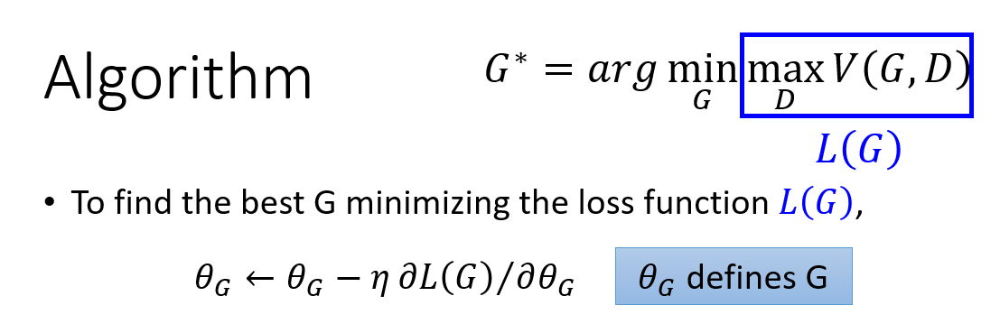

* Find the best G by minimizing L(G)
* Using gradient descent
* We have many possible generators
* Each generator is a different function
* Which means <code>L(G)</code> consists of many functions
* Gradient descent involves taking derivative of <code>V(G,D)</code> with respect to parameters of G
* How to differentiate a term consists of different functions ?

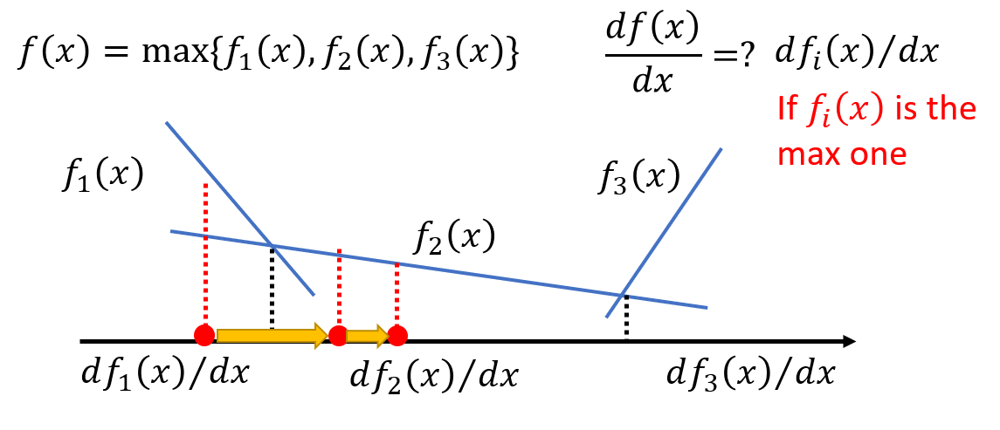
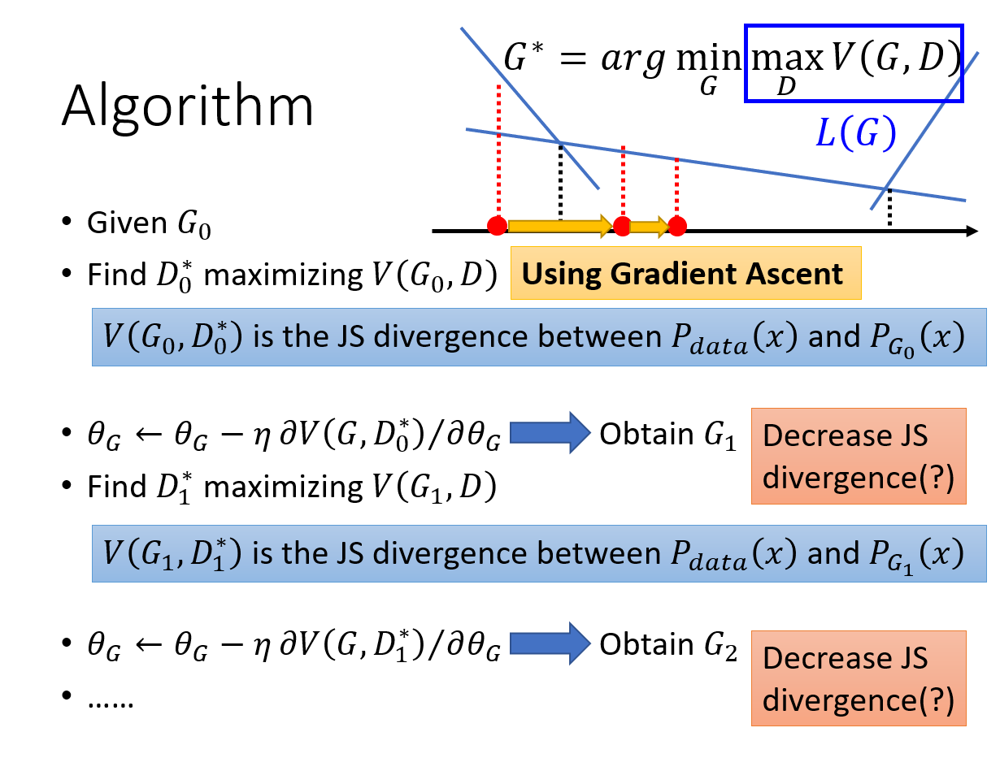

* Wehn update the Generator
>* V(G_t, D_t *) measures JS divergence
>* G_t ⟶ G_t+1
>* V(G_t+1, D_t *) is not equal to V(G_t, D_t *)
>* V(G_t+1, D_t *) no longer measures JS divergence
* Practically, we just assume G_t and G_t+1 are very similar
* As such V(G_t+1, D_t *) still measures JS divergence
* Therefore, we should not update Generator's parameters too many times

### Training Discriminator
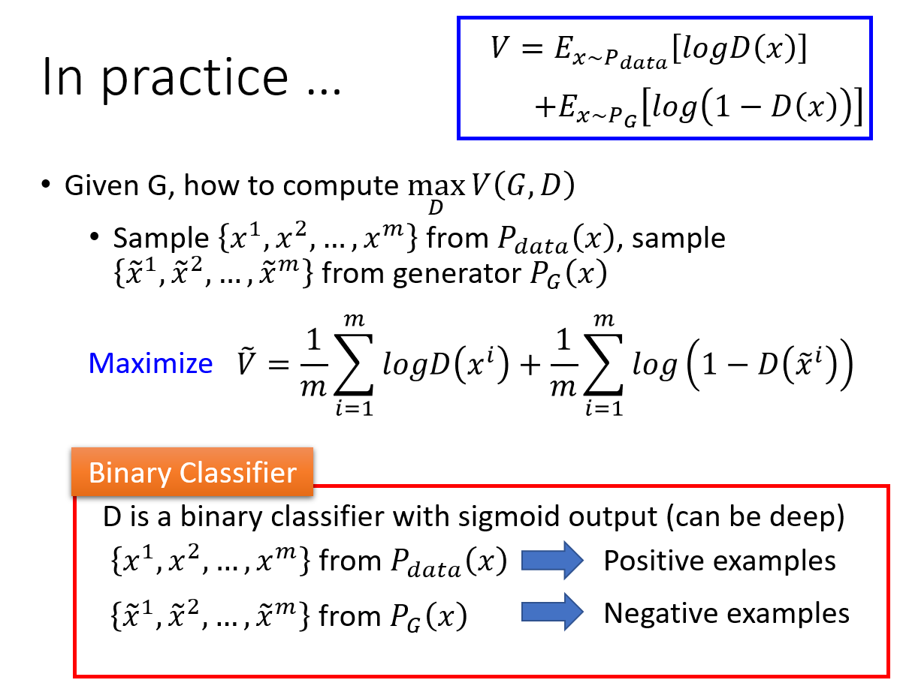

* We want to find a discriminator which maximizes the objective value
* Discriminator is a binary classifier with sigmoid output
* Sampled from database of real images as positive examples
* Sampled from <code>P_G</code> as negatuve examples
* Maximizing objective value is equivalent to minimizing cross entropy

### Full algorithm to train GAN
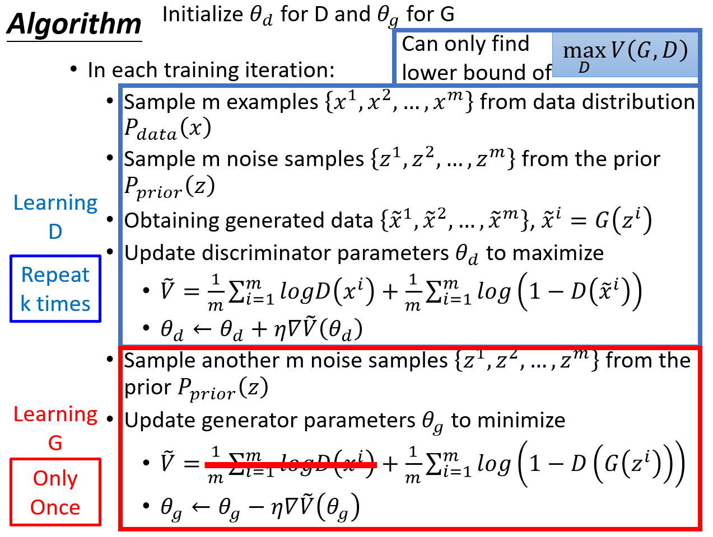

* Update discriminator more to approach maximum value which is related to JS divergence
* However only train G once per training iteration

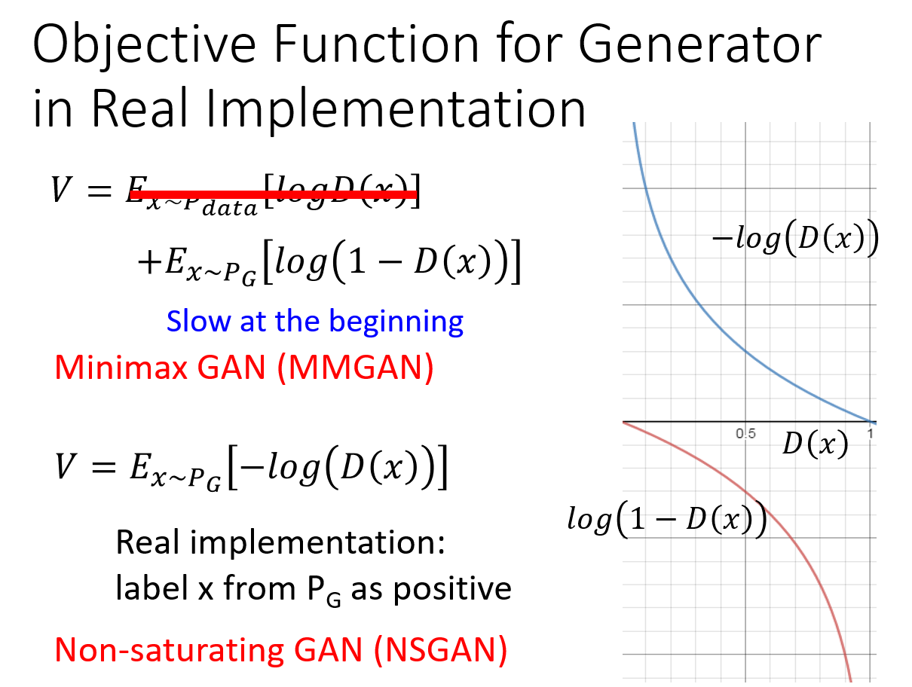

* Actually both implementations can be used to train GAN
* Non-saturating GAN: Change the label of generated images to 1 when learning **G**

