## General Framework 

For GAN, the discriminator is evaluating the JS divergence between <code>Pdata</code> and <code>P_G</code> . There are other types of divergence which can be used in GAN.

Given P and Q are two distributions, <code>p(x)</code> and <code>q(x)</code> are the probability of sampling *x* from the distribution. Generally, a f-divergence is a function <code>Df(P||Q)</code> :

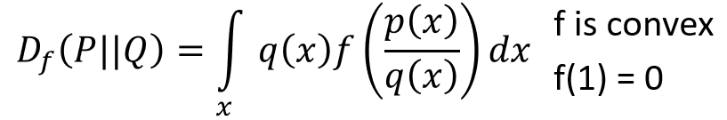

where *f* is a convex function and *f*(1) = 0.

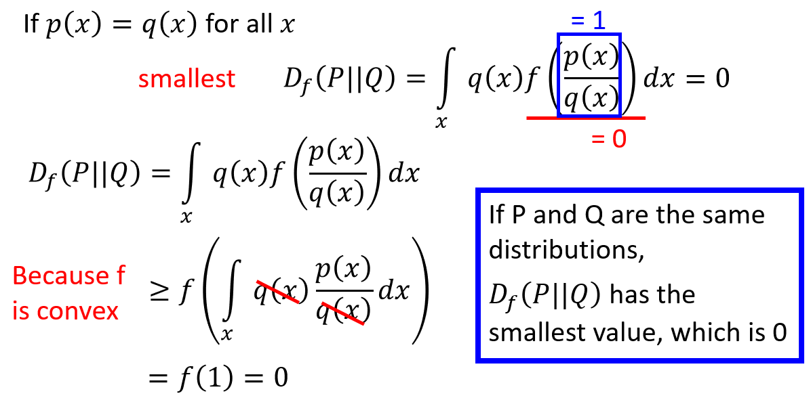

* <code>If p(x) = q(x), Df(P||Q) = 0 </code>
* The lower bound of f-divergence is 0
* If P and Q are different, f-divergence > 0

**Different choice of function as *f***

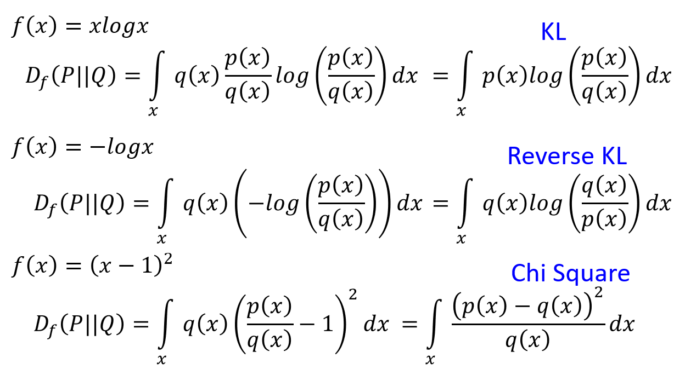

* Different choice of convex function which fulfills the condition f(1) = 0 results in different type of divergence

### Fenchel Conjugate

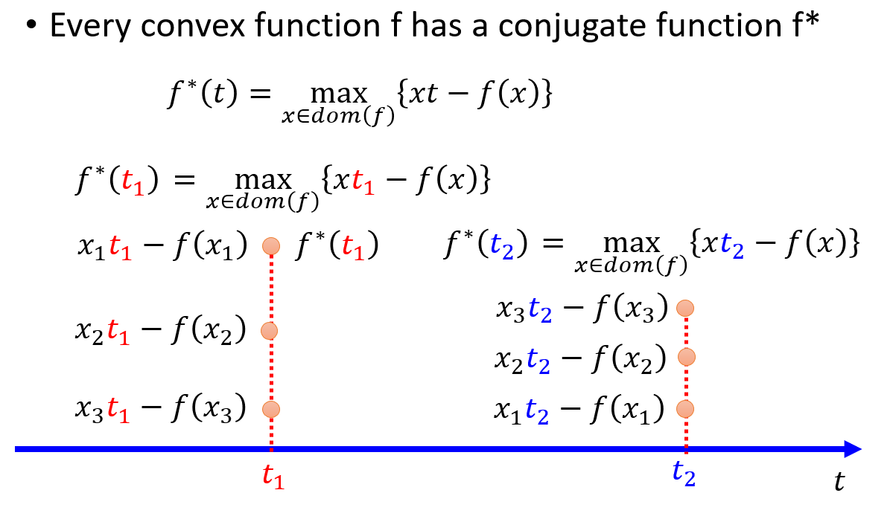

* Each convex function has a conjugate function *f**
* Given a *t*, find a *x* which maximize the *xt - f(x)*
* Another method :

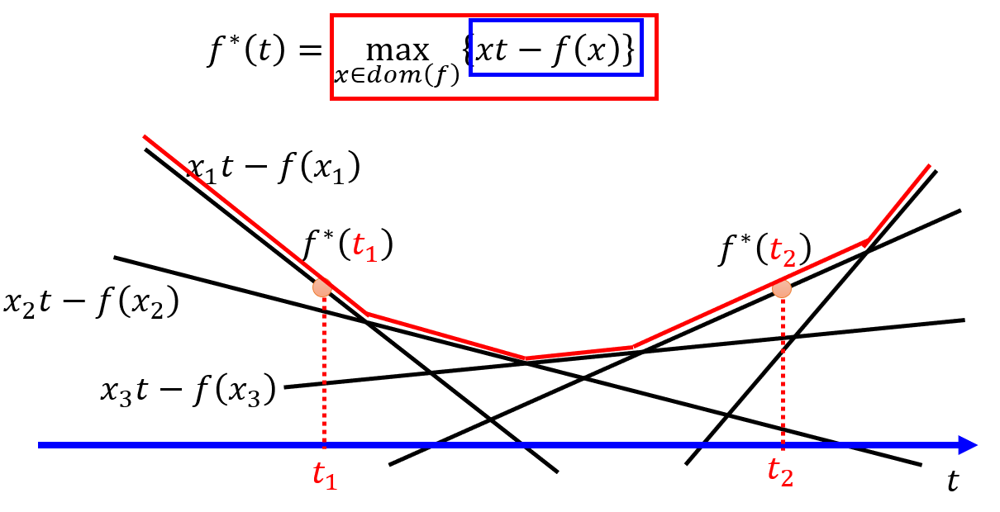

* For each given *x*, results in a different *xt - f(x)* line
* Plot all the lines 
* Find the maximum at each position of *t*, this gives the conjugate function *f**

* Another example, find Fenchel Conjugate of <code>f(x) = x log(x)</code>

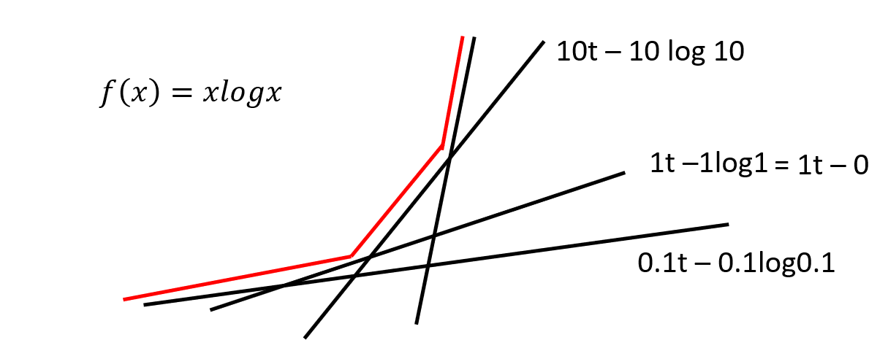

* The red line indicates the conjugate
* Looks like an exponential function

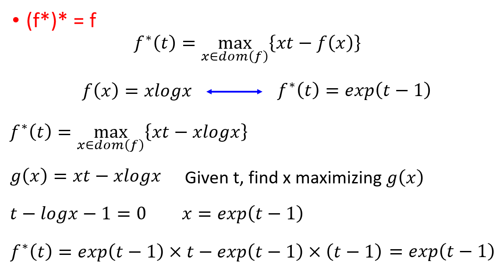

* Proof of the conjugate of <code>f(x)  = x log(x)</code> is <code>f*(t) = exp(t-1)</code>

### Connection to GAN

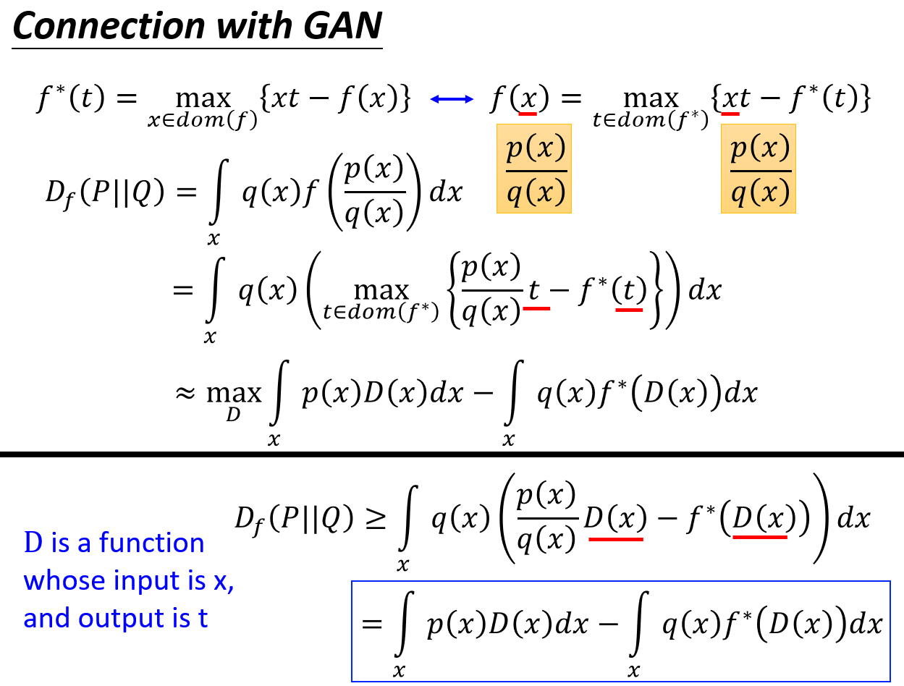

* Use discriminator to solve the maximization problem
* Substitute t = D(x)
* Discriminator has limited capacity, because it has limited number of parameters
* If randomly select a discriminator, the value may be smaller the one in blue box
* We want to find the best discriminator which approximates or approaches the **f-divergence**

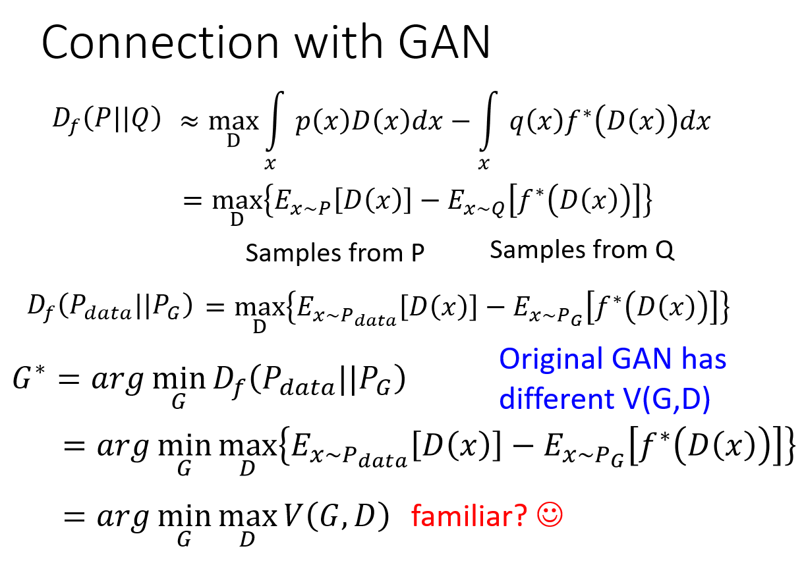

* The equation can be written as expectation
* The divergence is converted to a maximization problem of discriminator
* It can replace the original V(G,D) which measures the JS divergence

### Divergence choices :
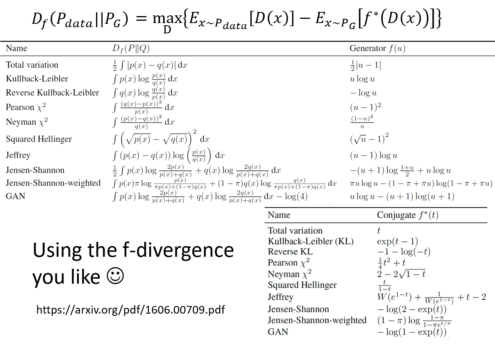

### Mode Collapse
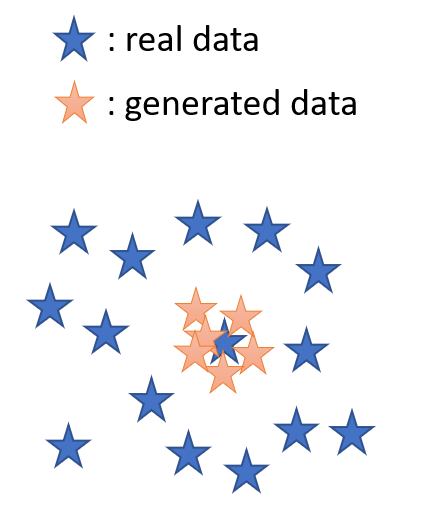

* The distribution P_G becomes smaller than Pdata
* Resulting the repeated generation of similar images with minor differences

### Mode Dropping
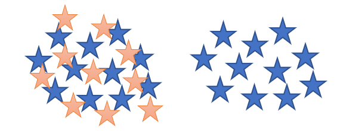

* There are more than one cluster for Pdata
* P_G approximates less clusters 

### The reason

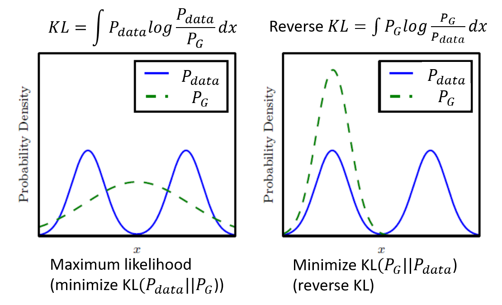

* On the left, there are two modes for Pdata
* Using maximum likelihood estimation, P_G does not approximate any mode of Pdata at its peak
* This may be a reason why maximum likehood estimation results in generation of blurry images
* On the right, reverse KL divergence is used
* P_G on the very least approximate one of the mode of Pdata
* The choice of divergence can be a hyperparameter
* However, if changing the divergence used does not solve mode collapse and mode dropping problem
* The problem may lies elsewhere

### Ensemble of GAN

* The best solution to mode collapse and mode dropping is to use an ensemble of GAN
* Train a set of generators {G1, G2, G3, ..., GN}
* To generate an image, randomly pick a generator to generate
* This could avoid mode collapse and mode dropping