## Tips for Improving GAN

### JS divergence is not suitable
* Original GAN uses JS divergence
* JS divergence may not be suitable to measure divergence between <code>Pdata</code> and <code>P_G</code>
* In most cases, <code>Pdata</code> and <code>P_G</code> are not overlapped
1. The nature of data
    * Both <code>Pdata</code> and <code>P_G</code> are low-dimensional manifold in a high-dimensional space
    * The overlap can be ignored

2. Sampling: 
    * <code>Pdata</code> and <code>P_G</code> have overlap
    * During sampling, we took some samples from both <code>Pdata</code> and <code>P_G</code>
    * Out of all the samples, the number of samples from overlap region might be small
    * So the overlap is negligible

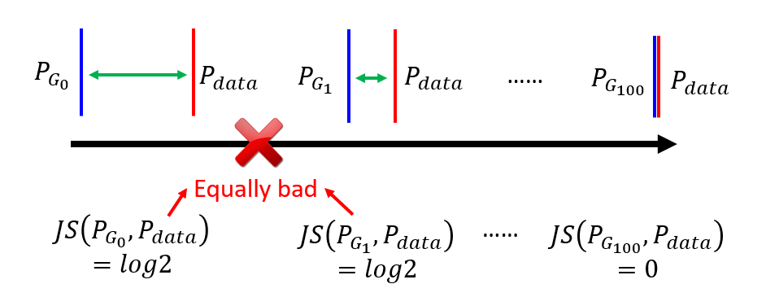

* If there is no overlap between 2 distributions, the JS divergence is **log 2**
* As shown in figure above, G1 seems to be closer to Pdata compared to G0
* They are equally bad, because their JS divergences are the same
* If we look from a binary classifier perspective, as long as **P_G** and **Pdata** does not overlap, binary classifier can achieves 100% accuracy
* Because there is a clear gap between **P_G** and **Pdata** as long as there is no overlap
* This results in **same objective value and same loss** continuously

### Least Square GAN (LSGAN)

* Change classification to regression
* Replace activation function from **sigmoid** to **linear**
* If use sigmoid, may face problem of zero derivative

* Blue = P_G, Green = Pdata
* During training, we want to move the P_G towards Pdata
* Because the output's activation is sigmoid
* We may a problem like in figure above
* The gradient is close to 0
* Training is stucked, parameters are not updated or changes negligibly
* Can be avoided by reducing number of iterations of training discriminator
* But this caused a problem to arise
* How to define "too much" ?
* How much is too much
* We do not know exactly !
* Replacing sigmoid with linear
* Real images labeled with 1
* Generated images labeled with 0

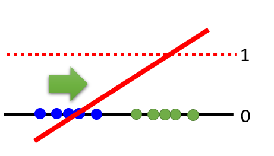

* The gradient will be > 0
* Training is not stucked due to zero gradient

### Wasserstein GAN (WGAN)

**Earth Mover's Distance** or **Wasserstein distance** :
* Considering a distribution **P** as a pile of earth and another distribution **Q** as the target
* Earth mover's distance is the average distance the earth mover has to move the earth

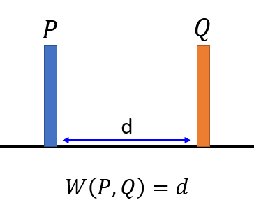

* If the distribution is just a 1-dimension point, the earth mover's distance is the distance between point P and Q
* For distribution in higher distribution, they might be more than one way to move from P to Q
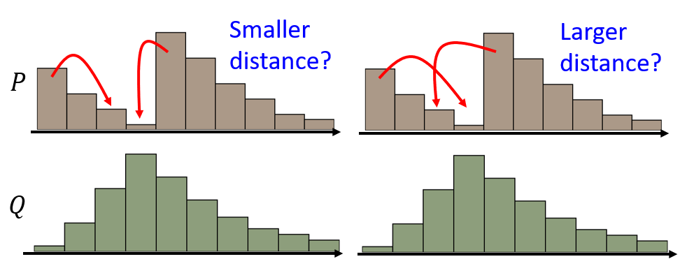
* The method to move is called **Moving plan**
* Some moving plans take longer distance
* Earth mover's distance take on moving plan with smallest average distance
* Reference: https://vincentherrmann.github.io/blog/wasserstein/

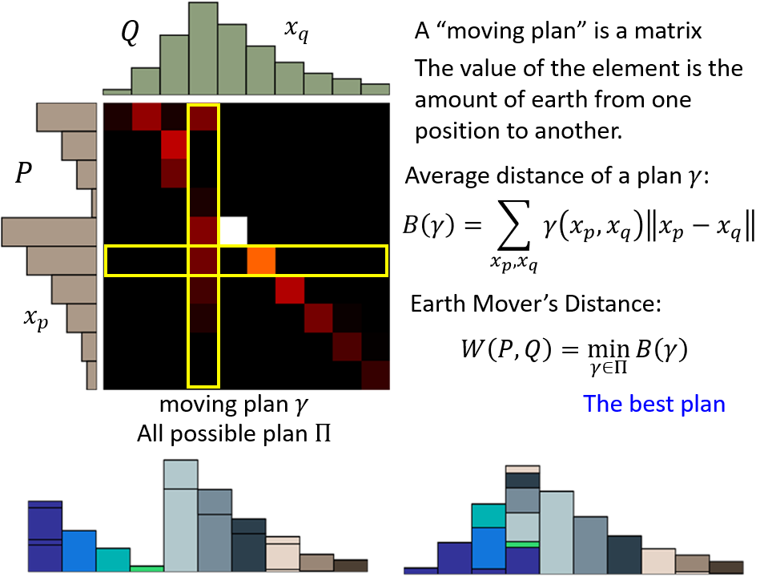

* Moving plan is a matrix
* The value of each element is the amount of earth from one position to another
* For example, one moving plan is shown on top left
* Brightness indicates amount of earth
* Black means no movement
* The earth mover's distance is the minimum average distance of a moving plan

**Reason for using Wasserstein distance over JS divergence** :
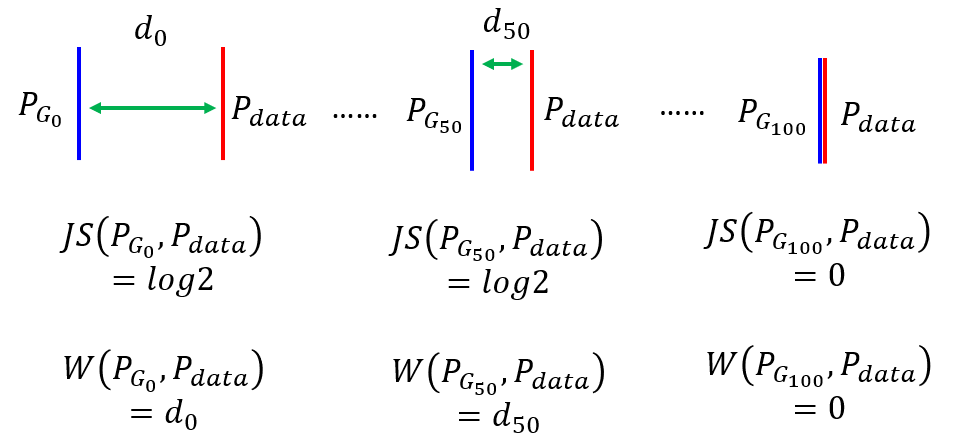
* JS divergence for two distributions with no overlap is always **log 2**
* Wasserstein distance can measure divergence between 2 distributions with no overlap
* The smaller the distance between two distributions, the smaller the Wasserstein distance
* The calculation of **Wasserstein distance** becomes an optimization problem
* How to measure Wasserstein distance between Pdata and P_G ?
* Replace with D(x)
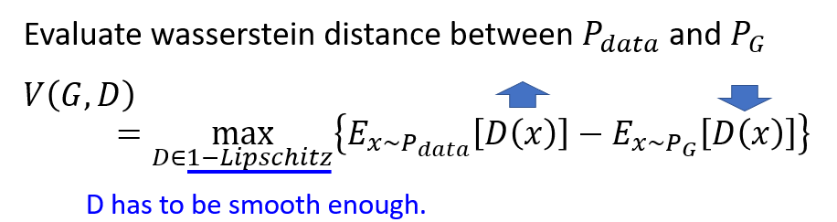
* D has to be a 1-Lipschitz function

What is 1-Lipschitz function ?

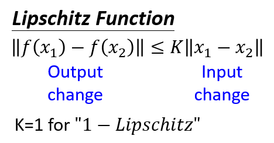

* The change in output is smaller than change in output
* D has to be **smooth** enough

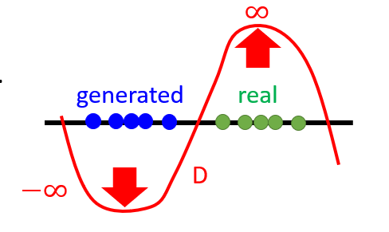

* If the constraint is not there
* Assume there is no overlap between generated images and real images as shown in the figure above
* Prediction for real images by discriminator can always become bigger and approach infinity
* Prediction for generated images can always become smaller and approach negative infinity
* Therefore, training can't converge
* It is not **smooth**
* Author of WGAN paper does not provide a method to implement the 1-Lipschitz function constraint
* The authored introduced **weight clipping**
* Clip the parameters of discriminator by (-c,c)
* If parameters > *c*, then *w* = *c*
* If parameters <  -*c*, then *w* = -*c*
* This method cannot fulfils the constraint
* But making the parameters limited to range of value might be able to limit the change in output

### Improved WGAN (WGAN-GPS)

* Another way of fulfiling the constraint of having **D** to be a 1-Lipschitz function

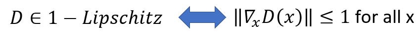

* A differentiable function is 1-Lipschitz function if and only if it has gradients with norm less than 1 or equal to 1 everywhere

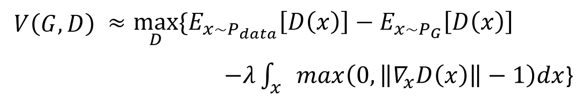

* Can approximate the constraint of having gradient norm <= 1 by adding a penalty
* If gradient norm > 1, there is a penalty
* If gradient norm <= 1, there is no penalty
* However, we cannot apply the penalty for all possible *x* in image space since we can only sample some *x* from <code>Pdata</code> and <code>P_G</code>

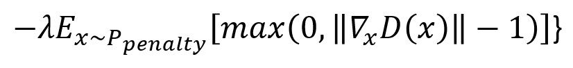

* Change to apply only to a distribution **P_penalty**

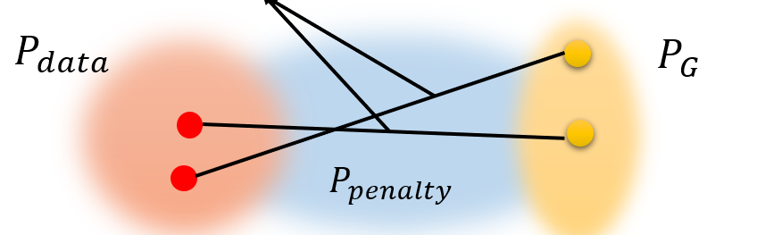

* The paper states:

>Given that enforcing the Lipschitz constraint everywhere is intractable, enforcing it **only along these straight lines** seems sufficient and experimentally results in good performance.

* Gradient penalty to all *x* is not practical
* Applying gradient constraint onto **P_penalty** is possible
* Intuitively, it provides a path <code>P_G</code> to move towards <code>Pdata</code> via the direction of gradient when updating the parameters 
* Experimentally, it is found that when gradient closer to 1, it converges faster 
* Change penalty term in loss function to :
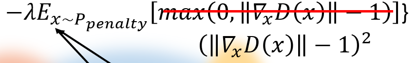
* Give penalty when < 1 and > 1 
* Give no penalty when equal to 1

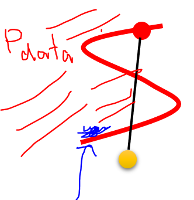

* However, there is a problem
* Applying constraint to the line doesn't make sense
* We should apply constraint to *x* of **Pdata** close to **P_G**
* In image above, red region indicates **Pdata**
* Yellow point indicates a sample of generated data sampled from **P_G**
* Instead of applying the constraint to the line
* Sample something of Pdata close to P_G and apply gradient constraint
* This is mentioned in a paper about an improved version to **WGAN-GP** and also DRAGAN
* **Spectrum normalization** is another method to keep gradient norm of every region smaller than 1

### Algorithm of WGAN 

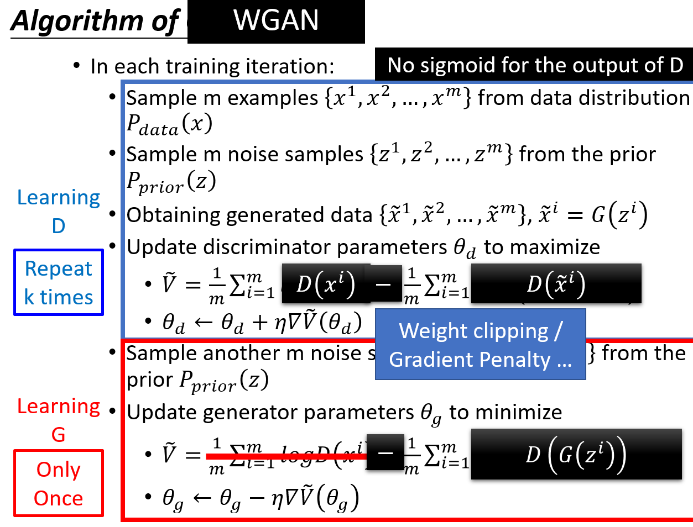

### Energy-based GAN (EBGAN)

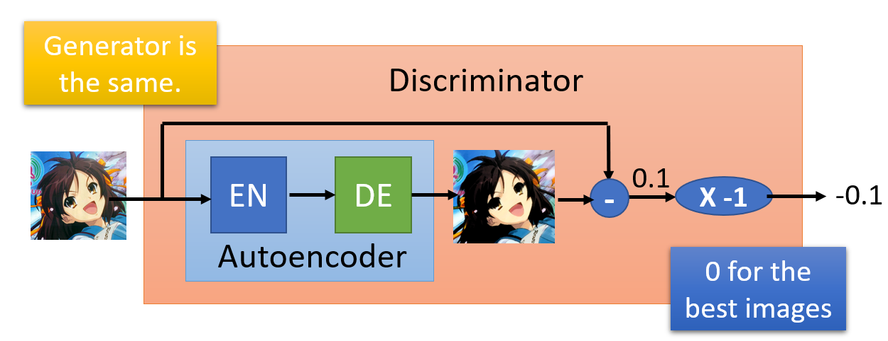

* Keep the generator, replace the discriminator with an **autoencoder**
* If reconstruction error is small, the image has a high quality
* If reconstruction error is high, the image has a low quality
* Advantage is that we can pretrain the autoencoder with real images
* For original GAN, the discriminator is not robust at the beginning, therefore have to train for quite a long time
* Using pretrained autoencoder, we can be better at discriminating in the beginning of training 
* We need the real image to have low reconstruction error
* However, we do not need the generated example to have **higher** reconstruction error
* It is easy to have input-output mismatch
* In other words, it is easier for autoencoder to learn to increase reconstruction error of generated images than learn to minimize reconstruction error of real images
* The learning might be overwhelm by pushing the generated images to have high reconstruction error which is not intended

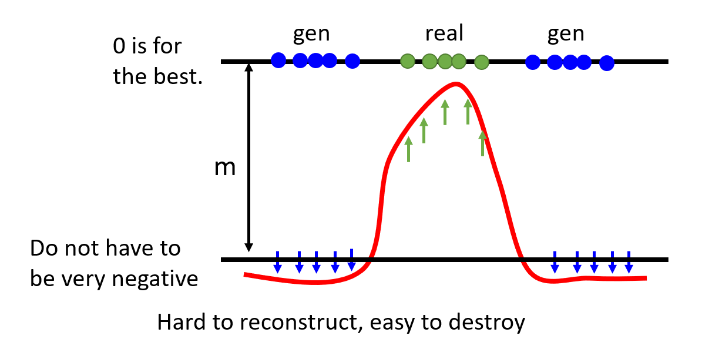

* Add a margin to limit how large the reconstruction error of generated images can be

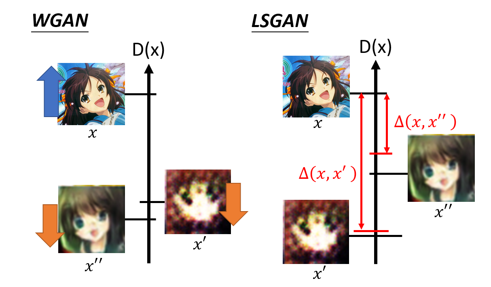

* Loss Sensitive GAN (LSGAN)
* Smaller margin for more realistic generated image
* Larger margin for more blurry generated image