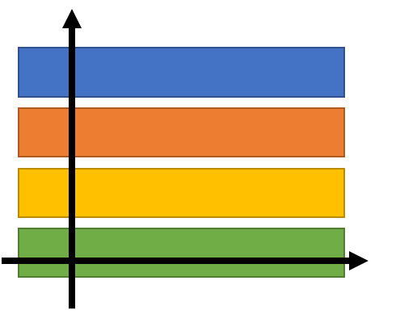
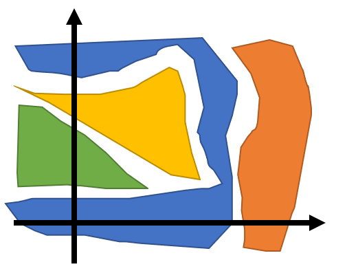
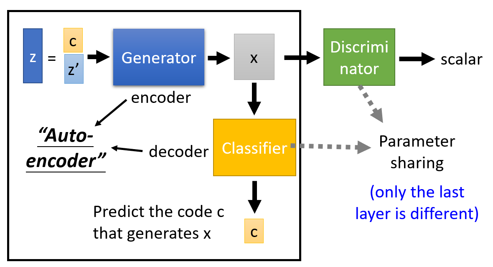
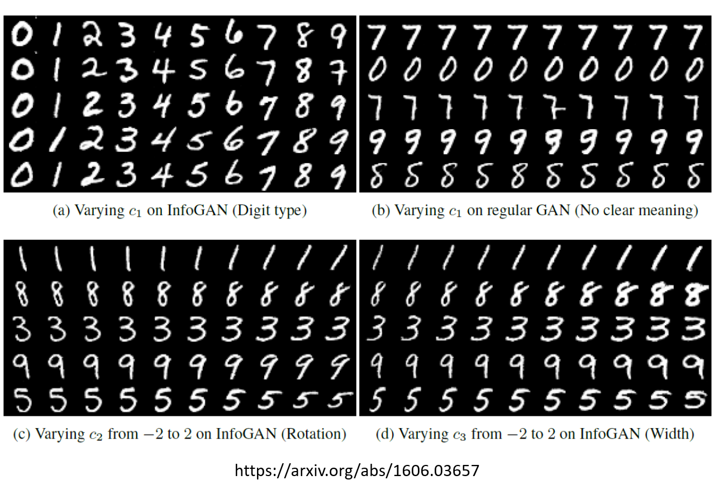
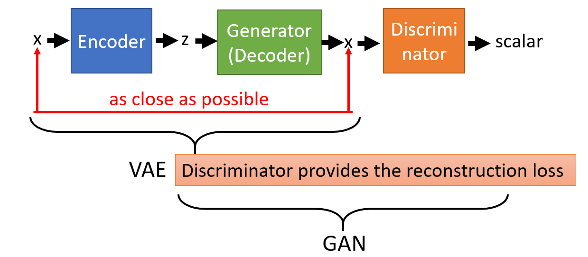
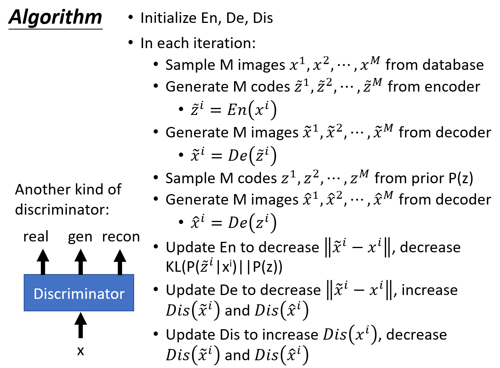
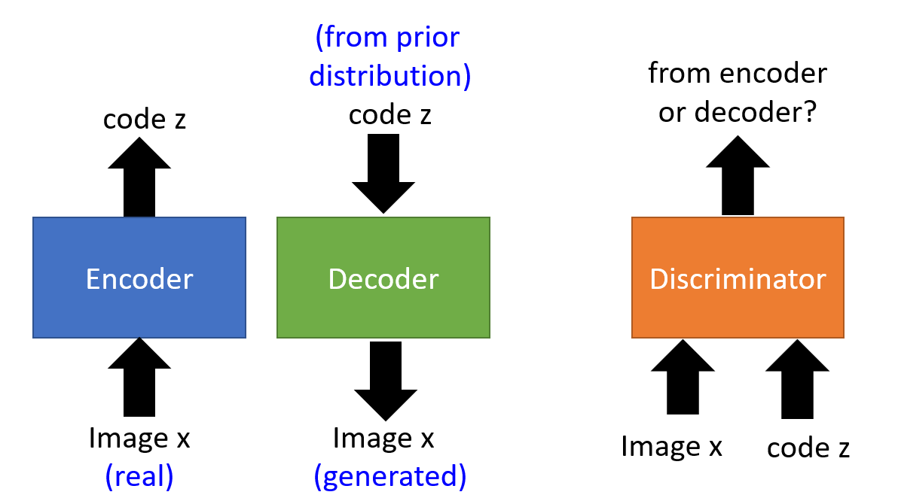
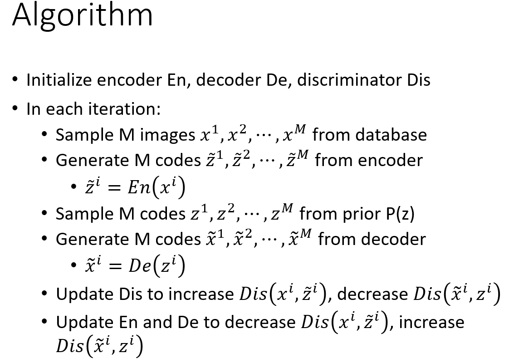
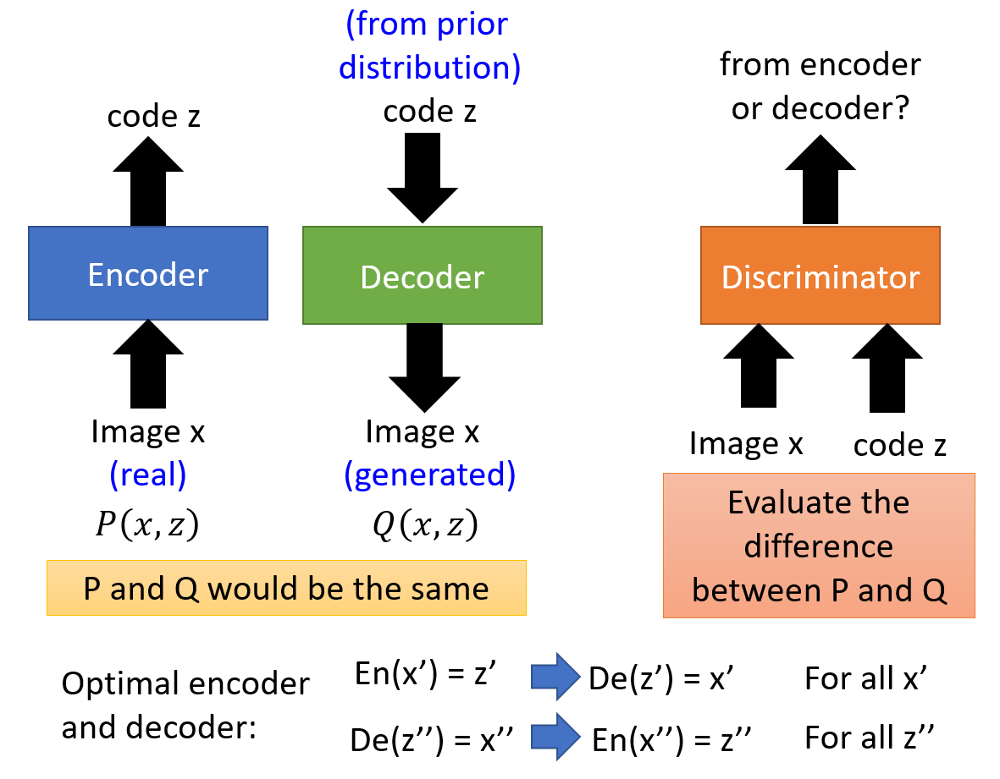

## Feature Extraction

### Original GAN

* For original GAN, the dimension of input vector *z* has no meaningful relationship on output
* Specific dimension of input vector *z* corresponds to certain meaningful characteristic in the generated image
* We hope the characteristics of image form distribution with pattern. 
* For example, if *z* have two 2 dimensions and the characteristics are colour. It might look like the following image
    

* However, in truth different characteristic does not form distribution with pattern. Looks like following image, without any pattern at all.

### InfoGAN

* Combination of auto-encoder and GAN
* Auto-encoder consists of encoder and decoder
* The input vector **z** is split into two part **c** and **z'**
* The encoder plays the role of Generator 
* The encoder converts **z** to an image **x**
* The decoder (classifier) recovers the code **c** from **x**
* Discriminator is necessary
* Generator wants to help decoder to decode **c** from **x**
* Without discriminator, Generator may learns to copy **c** onto **x**, which is the easiest way for the decoder to recover **c** from **x**
* Having discriminator helps to avoid this behavior by checking whether the generated **x** is real or fake
* **c** must have **clear influence** on **x** so that the decoder can deduce **c** from **x**
* **c** : specific dimension corresponds to meaningful characteristic on output
* **z'** : Randomness
* Question : How do we know that **c**'s dimension represents certain meaning on output ?
* Answer : We do not know **c** has meaningful influence on output. But following InfoGAN training, the generator learns to generate output which is influenced by **c** 

#### InfoGAN result:

### VAE-GAN
* Consists of Variational Auto-encoder (VAE) and GAN
* Can be seen as using VAE to strengthen GAN
* Can be seen as using GAN to strengthen VAE

* Encoder encodes images *x* to a vector *z*
* The distribution of *z* close to normal distribution
* Decoder reconstruct *x* from the vector *z*
* Minimize the reconstruction error
* Decoder also plays the role of Generator, to **fool** the Discriminator
* Discriminator differentiates real, generated and reconstructed images
* From VAE viewpoint :
    * VAE generates images which are blurry
    * Addition of Discriminator provide feedback to generator
    * Generator generates more realistic image

* From GAN viewpoint:
    * Generator is fed a randomly sampled vector
    * Generator has not seen any images
    * Will take a lot of effort to update parameters to learn how real images look like
    * Auto-encoder minimizes reconstruction error
    * Because decoder (generator) needs to reconstruct an image that looks like input (real) image from a vector, it knows how real image looks like
    * Combination of GAN and auto-encoder, the training is more stable

* Update encoder to reduce reconstruction error
* Update generator to reduce reconstruction error, increase D(generated) and increase D(reconstructed)
* Update discriminator to increase D(real), decrease D(generated) and D(reconstructed)
* Another kind of discriminator, differentiates the input to discriminator is real, generated or reconstructed

## BiGAN

* Consists of encoder and decoder
* Encoder encodes the real images into code *z*
* Decoder decodes the code *z* sampled from normal distribution into image
* This makes both encoder and decoder have their own pair of *z* and *x*
* The output of encoder is not used as input to decoder and vice versa
* Input and output of encoder and decoder are fed to the discriminator
* Discriminator differentiates whether the input-output pair comes from encoder or decoder

* Update discriminator to increase D(encoder_pair) and decrease D(decoder_pair)
* Update encoder and decoder to decrease D(encoder pair) and increase D(decoder pair)
* Can switch to increase or decrease encoder or decoder, the result is the same

* Discriminator: Evaluate two distributions are close or not (Divergence)
* Encoder's input and output form a joint distribution **P(x,z)**
* Decoder's input and output form a joint distribution **Q(x,z)**
* Wants P and Q to be closer 
* If the P and Q are the same, we would have optimal encoder and decoder with properties as shown in the figure above
* So why not train **two auto-encoders** ?
* The generated images would be blurry 
* For BiGAN, the output is different but realistic / clear
* For example, encoder converts an image of bird to code
* The decoder will not reconstruct the image of same bird, but rather generates an image of a different bird

## Domain Adversarial Training

