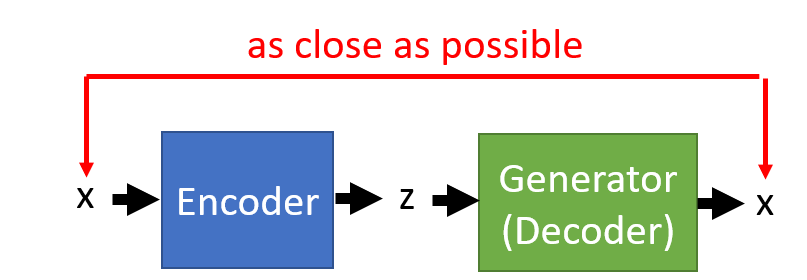
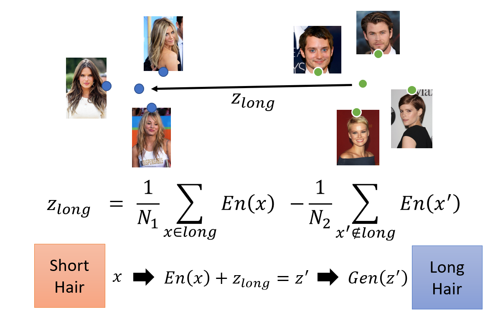
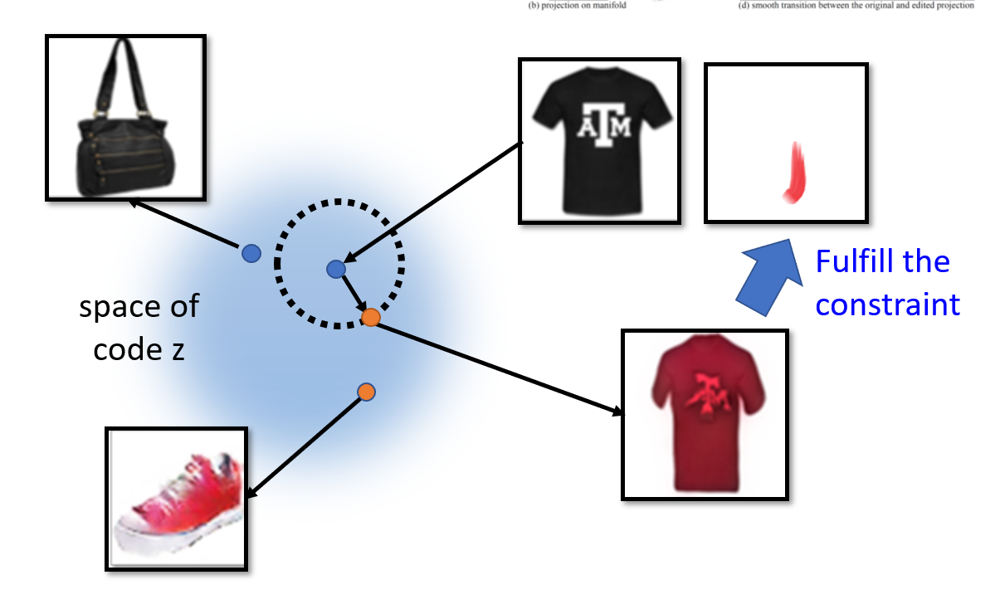
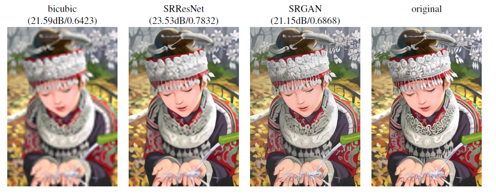

## Photo Editing

* We want to edit photo by modifying some value of dimension of input vector *z* 
* For example, change the color of hair
* Dimension of *z* influence what characteristic on output ? We do not know

### GAN + Auto-encoder
* We have a trained generator which takes input *z* and generates an image *x*
* Given *x*, learn an **encoder** to find *z*
* Structure:

* Fix the Generator's parameters
* Given a real image *x*, encoder produce a vector *z* which is fed to generator to generate an image
* We want both the input and output image to be as close as possible
* Can use *Discriminator* parameters to initialize encoder's parameters

* For example, we want to modify short hair to long hair
* Take some real images of long hair and short hair
* Feed the images to encoder to generate *z*
* Calculate the average for **z**'s of long hair
* Calculate the average for **z**'s of short hair
* Then calculate the difference between these two average which is denoted by **z**_long
* To edit a short hair image to have long hair, feed it to encoder which generates a vector
* Add the vector and **z**_long results in a new vector **z'**
* Feed **z'** to the generator to generate an image

### Photo Editing

* We want to edit a black T-shirt into red
* Have a GAN which was trained to generate items such as bag, shirt and shoes
* Sample a vector from the **space of code z** and feed it to a Generator, can generate various items
* Basic Idea:
    * Encode the image of black T-shirt to a code *z*
    * Modify the code *z* slightly 
    * Input the new code to generator to generate red T-shirt
    * Fulfils constraint: similar to *z* and editing constarint : red 

#### Convert image to z

#### Method 1 

* A new optimization problem
* Find a *z* which minimize difference between **G(z)** and **x**
* The difference or loss can use:
    * Pixel-wise 
    * By another network: Take a trained network to encode the original image and generated image  into vector

#### Method 2

* GAN + Auto-encoder

#### Method 3

* Use the parameters of encoder (Method 2) to initialize the network (Method 1)

#### Loss for Photo editing

* **z0** is the code of original image
* The first term **U(G(z))** is to fulfil the editig constraint
* Second term : The new *z* is not too far from **z0** so that the generated image is still a T-shirt
* Third term: Discriminator checks the generated image is realistic or not

### Image super resolution

* Use conditional GAN
* Collect high resolution images, shrink these images to get low resolution image
* The generated images using GAN have original and different markings on the hat
* As long as the generated images fools the Discriminator, it's okay
* The markings don't have to be the same as original

### Image Completion

* Use conditional GAN
* Collect real images
* Take away part of images as the target
